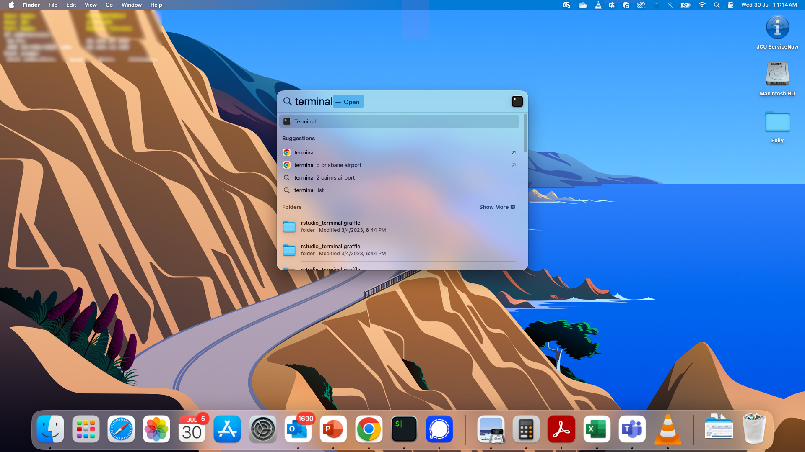
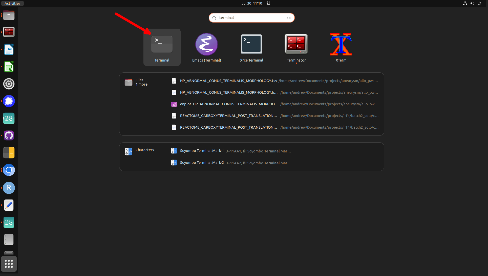
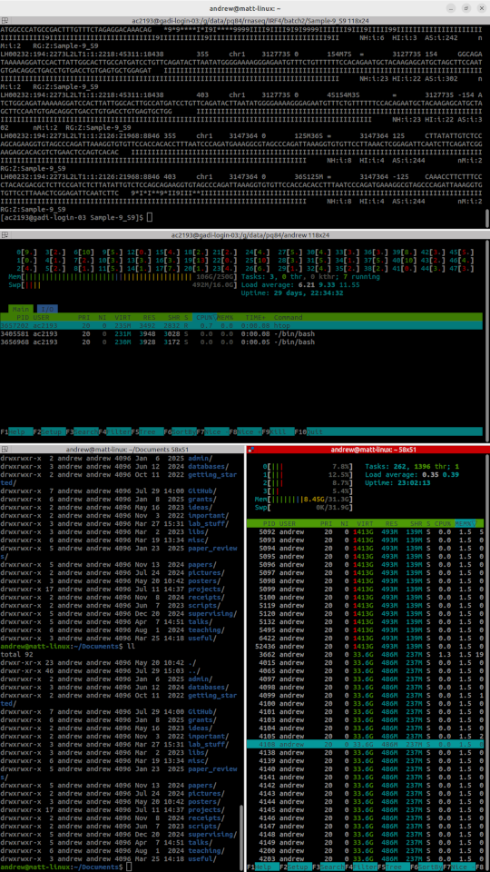
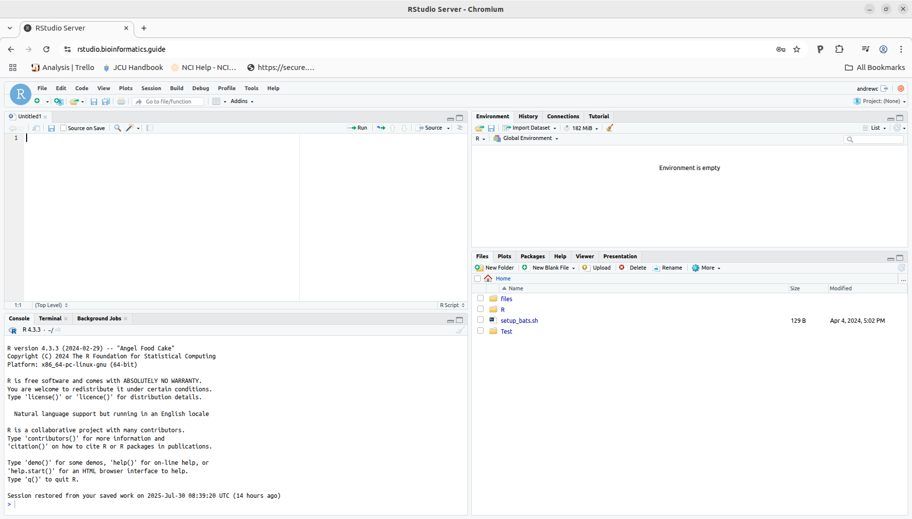
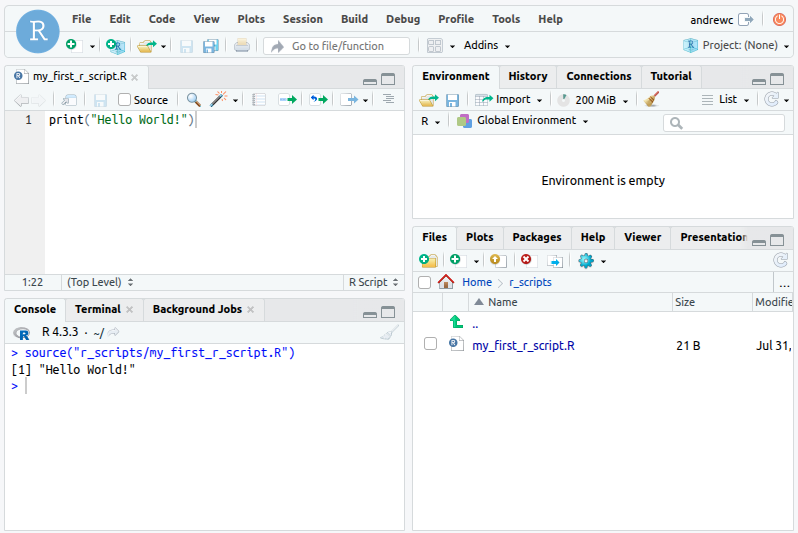
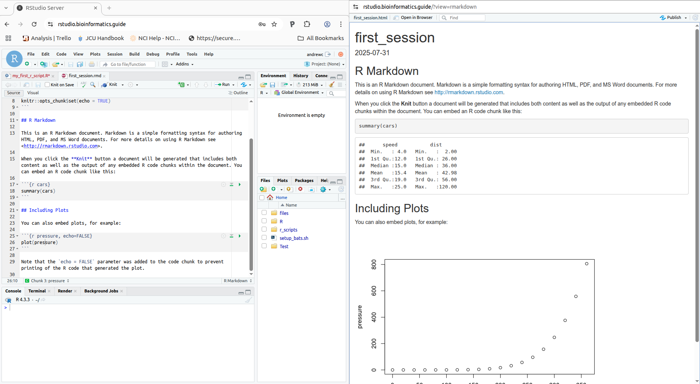

# Introduction to Bash, R and common bioinformatic file formats

Today we will be getting familiar with two common environments that bioinformaticians commonly operate in - [Bash](https://en.wikipedia.org/wiki/Bash_(Unix_shell)) and R (RStudio). We are forunate to have access to a powerful linux server that we can use to execute all our code. First up we are going to try and access this server from the command line and then afterwards, we'll start getting familiar with RStudio.

## Logging in

To access the server, we will use the [SSH (Secure SHell) protocol](https://en.wikipedia.org/wiki/Secure_Shell) which is a secure way to access a server from your own computer. The way that we will do this depends on the operating system running on your computer.

For Linux and Mac users, open up the Terminal app.





For PC users, you may have to first download an ssh client such as [Putty](https://www.putty.org) however newer versions of Windows have a built in ssh client called [OpenSSH](https://learn.microsoft.com/en-us/windows/terminal/tutorials/ssh).

For Mac users, there are other more sophisticated terminal option you can try out if you like. The one I use is is called [iTerm2](https://iterm2.com/). Linux also has plenty of options but I like [Terminator](https://gnome-terminator.org/). In both of these you can split your window vertically or horizontally to have more than one terminal window open at the same time.



Once you open your terminal, you can access the server by typing the following:

```bash
ssh [username]@bioinformatics.nec-mf-proj01.cloud.edu.au/
```

where [username] is your username in the format of your first name followed by your last initial with no spaces. So for me, Andrew Calcino, my username would be andrewc. Once you hit enter, you'll be asked for a password. This will be XXX. Once you are in, we can start to explore the server and to learn some basic tools for navigating in a Linux environment. 

## Navigating on the command line

When you first log in, the first thing you will see is a line something like this:

test_user_1@bioinfo:~$

This is called the command prompt and it is from here that we issue commands to the terminal. At login, you will be located in a directory called 'home'. You can see this by trying out our first command - pwd which stands for 'print working directory'.

```bash
test_user_1@bioinfo:~$ pwd
/home/andrewc
```

The terminal is a way to access the filesystem of our server and so we can use it to see what files and folders are in our current directory using either the `ls` command or the `ll` command. Both of these give us a list of files and folders in our current directory however `ll` also provides a bunch of extra information including the date and time they were last modified, their size, who owns them and who has permission to read, write and execute them. If you are interested in how linux permissions work, have a look at [this](https://www.redhat.com/en/blog/linux-file-permissions-explained).

```bash
test_user_1@bioinfo:~$ ls
R  shared-data  shared-software  shiny-server
test_user_3@bioinfo:~$ ll
total 40
drwxr-x---  4 test_user_3 test_user_3 4096 Aug 18 04:10 ./
drwxr-xr-x 11 root        root        4096 Aug 18 04:17 ../
-rw-r--r--  1 test_user_3 test_user_3  220 Aug 18 04:09 .bash_logout
-rw-r--r--  1 test_user_3 test_user_3 3831 Aug 18 04:09 .bashrc
drwx------  2 test_user_3 test_user_3 4096 Aug 18 04:10 .cache/
drwxr-xr-x  6 test_user_3 test_user_3 4096 Aug 18 04:10 .config/
-rw-r--r--  1 test_user_3 test_user_3  807 Aug 18 04:09 .profile
lrwxrwxrwx  1 root        root          17 Aug 18 04:09 shared-data -> /data/shared-data/
lrwxrwxrwx  1 root        root          21 Aug 18 04:09 shared-software -> /home/shared-software/
lrwxrwxrwx  1 test_user_3 test_user_3   17 Aug 18 04:09 shiny-server -> /srv/shiny-server/
-rw-------  1 test_user_3 test_user_3  761 Aug 18 04:10 .viminfo
-rw-r--r--  1 test_user_3 test_user_3 1600 Aug 18 04:09 .Xdefaults
-rw-r--r--  1 test_user_3 test_user_3   14 Aug 18 04:09 .xscreensaver
```

`ll` also shows some files that are not visible with `ls`. These are hidden files that begin with a `.` in their name. Currently, the only normal (non-hidden) things in my home directory are a file called `setup_bats.sh` and two folders called `files` and `R/` . Let's create a directory called `Test` using the command `mkdir` (make directory).

```bash
test_user_1@bioinfo:~$ mkdir Test
test_user_1@bioinfo:~$ ll
total 60
drwxr-x---  7 test_user_1 test_user_1 4096 Aug 18 04:21 ./
drwxr-xr-x 11 root        root        4096 Aug 18 04:17 ../
-rw-------  1 test_user_1 test_user_1  965 Aug 18 03:40 .bash_history
-rw-r--r--  1 test_user_1 test_user_1  220 Aug 13 23:01 .bash_logout
-rw-r--r--  1 test_user_1 test_user_1 3905 Aug 15 05:37 .bashrc
drwx------  2 test_user_1 test_user_1 4096 Aug 14 00:34 .cache/
drwxr-xr-x  8 test_user_1 test_user_1 4096 Aug 14 01:29 .config/
drwxrwxr-x  3 test_user_1 test_user_1 4096 Aug 13 23:40 .local/
-rw-r--r--  1 test_user_1 test_user_1  807 Aug 13 23:01 .profile
drwxr-xr-x  3 test_user_1 test_user_1 4096 Aug 14 05:28 R/
-rw-r--r--  1 test_user_1 test_user_1   15 Aug 14 04:48 .Renviron
-rw-r--r--  1 test_user_1 test_user_1  416 Aug 15 05:47 .Rhistory
lrwxrwxrwx  1 test_user_1 test_user_1   17 Aug 18 03:26 shared-data -> /data/shared-data/
lrwxrwxrwx  1 test_user_1 test_user_1   21 Aug 18 03:33 shared-software -> /home/shared-software/
lrwxrwxrwx  1 test_user_1 test_user_1   17 Aug 13 23:01 shiny-server -> /srv/shiny-server/
drwxrwxr-x  2 test_user_1 test_user_1 4096 Aug 18 04:21 Test/
-rw-r--r--  1 test_user_1 test_user_1 1600 Aug 13 23:01 .Xdefaults
-rw-r--r--  1 test_user_1 test_user_1   14 Aug 13 23:01 .xscreensaver
```

We can then move to this new folder using the `cd` command.

```bash
test_user_1@bioinfo:~$ cd Test/
test_user_1@bioinfo:~/Test$ pwd
/home/test_user_1/Test
```

So you can see that we are now in a sub directory of our original home directory. This folder is empty so lets create a file here.

```bash
test_user_1@bioinfo:~/Test$ echo "Hello World!" >hello.txt
test_user_1@bioinfo:~/Test$ ls
hello.txt
test_user_1@bioinfo:~/Test$ cat hello.txt 
Hello World!
```

Here I used the `echo` command to repeat a string of text and then I sent this to a new file called `hello.txt` using the `>` command. You'll see that in linux, most files are just text files and that the suffix doesn't do anything except inform the user what format the file is in. In this case, I used .txt because it is just a file containing a text string but if the contents were a tab delimeted, then I might call it `hello.tsv` for example. `cat` (concatenate) is a command for printing the contents of a text file to the screen.

Let's make a second file by copying the first.

```bash
test_user_1@bioinfo:~/Test$ cp hello.txt goodbye.txt
test_user_1@bioinfo:~/Test$ ls
goodbye.txt  hello.txt
test_user_1@bioinfo:~/Test$ cat hello.txt goodbye.txt 
Hello World!
Hello World!
```

Bash doesn't have a rename function. As a workaround, we use the `mv` function to move a file from one place to another and by doing this, we can give the file a new name. In this example we will move hello.txt to the same location it is currently in but with a new name.

```bash
test_user_1@bioinfo:~/Test$ mv hello.txt goodmorning.txt
test_user_1@bioinfo:~/Test$ ls
goodbye.txt  goodmorning.txt
```

Now lets move these two files to another location by first creating a directory.

```bash
test_user_1@bioinfo:~/Test$ mkdir Test2
test_user_1@bioinfo:~/Test$ mv goodmorning.txt Test2/goodnight.txt
test_user_1@bioinfo:~/Test$ mv goodbye.txt /home/andrewc/Test/Test2/
test_user_1@bioinfo:~/Test$ ls
Test2
test_user_1@bioinfo:~/Test$ cd Test2/
test_user_1@bioinfo:~/Test/Test2$ ls
goodbye.txt  goodnight.txt
```

I did a couple of things here that need explaining. After making `Test2` within the directory `/home/andrewc/Test` I moved `goodmorning.txt` to `Test2/` using a *relative path* and changed the name to `goodnight.txt` . A relative path is like an address that only makes sense *relative* to your current location. If you are at your home with a friend and you describe where the bus stop is, you might say something like:

`Go to the street out front, take a left walk 100m, take the next right and then the bus stop will be on the right hand side`.

This is a perfectly valid way to describe a location but it would make no sense if your friend was at shopping centre in a different city. If they followed those instructions, they would certainly not end up at the correct bus stop and most likely not at a bus stop at all. An alternative would be to use an *absolute path* which you can think of like a precise address. Now if you wanted to tell your friend where the bus stop was, you could say:

```
6 Smith St
Smithfield 4878
Smithington
Smithistan
```

This is an address that anyone could use to find a bus stop no matter where they are in the world. In linux, absolute paths describe the precise location of a file of interest within filesystem. So back to our example, we moved `goodbye.txt` to its new home at `/home/andrewc/Test/Test2/` .

Let's remove one of these files now, first making sure that you are in the correct directory using `pwd`.

```bash
test_user_1@bioinfo:~/Test/Test2$ pwd
/home/andrewc/Test/Test2
test_user_1@bioinfo:~/Test/Test2$ ls
goodbye.txt  goodnight.txt
test_user_1@bioinfo:~/Test/Test2$ rm goodbye.txt 
test_user_1@bioinfo:~/Test/Test2$ ls
goodnight.txt
```

Done! The thing to remember is that there is no recyle bin here. One you've deleted a file or folder, that's it, you're not getting it back so make sure you are sure about what you are doing before you hit enter! This is doubly true of removing a folder. Let's try that next but first let's get out of `Test2` and back in to `Test`.

```bash
test_user_1@bioinfo:~/Test/Test2$ pwd
/home/andrewc/Test/Test2
test_user_1@bioinfo:~/Test/Test2$ cd ..
test_user_1@bioinfo:~/Test$ ls
Test2
```

To get back to `Test` you can see that I used `cd ..` . The two dots there indicate that I want to move back one directory relative to my current location. If I want to move two directories back from my current location I could use `cd ../..` . One other thing to note is that while `..` represents one directory back, `.` represents the current directory, so if I did `cd .` I would change directory to my current directory, meaning I would remain exactly where I already was. Now let's delete `Test2`.

``` bash
test_user_1@bioinfo:~/Test$ rm Test2/
rm: cannot remove 'Test2/': Is a directory
test_user_1@bioinfo:~/Test$ rm -r Test2/
test_user_1@bioinfo:~/Test$ ls
test_user_1@bioinfo:~/Test$
```

My first attempt to remove the folder failed because `rm` only works for files. To remove folders you need to append the *option* `-r` to `rm`. Options are ways to modify the function of a command and most commands will have lots of options. You can see the list of options for a command using `--help` or in some cases `-h`.

```bash
test_user_1@bioinfo:~/Test$ rm --help
Usage: rm [OPTION]... [FILE]...
Remove (unlink) the FILE(s).

  -f, --force           ignore nonexistent files and arguments, never prompt
  -i                    prompt before every removal
  -I                    prompt once before removing more than three files, or
                          when removing recursively; less intrusive than -i,
                          while still giving protection against most mistakes
      --interactive[=WHEN]  prompt according to WHEN: never, once (-I), or
                          always (-i); without WHEN, prompt always
      --one-file-system  when removing a hierarchy recursively, skip any
                          directory that is on a file system different from
                          that of the corresponding command line argument
      --no-preserve-root  do not treat '/' specially
      --preserve-root[=all]  do not remove '/' (default);
                              with 'all', reject any command line argument
                              on a separate device from its parent
  -r, -R, --recursive   remove directories and their contents recursively
  -d, --dir             remove empty directories
  -v, --verbose         explain what is being done
      --help     display this help and exit
      --version  output version information and exit

By default, rm does not remove directories.  Use the --recursive (-r or -R)
option to remove each listed directory, too, along with all of its contents.

To remove a file whose name starts with a '-', for example '-foo',
use one of these commands:
  rm -- -foo

  rm ./-foo

Note that if you use rm to remove a file, it might be possible to recover
some of its contents, given sufficient expertise and/or time.  For greater
assurance that the contents are truly unrecoverable, consider using shred.

GNU coreutils online help: <https://www.gnu.org/software/coreutils/>
Full documentation <https://www.gnu.org/software/coreutils/rm>
or available locally via: info '(coreutils) rm invocation'
```

Amongst the various options available to `rm` you will see the `-r` option to recursively remove folders and their contents. As an exercise, try `--help` with `cat`, `ls` and `mkdir`. Test out `ls -l` to see something familiar.

## Exploring common filetypes

Let's move into that files directory located within our home directory and have a look at its contents.

```bash
test_user_1@bioinfo:~$ cd ~/shared_data/tut_1
test_user_3@bioinfo:~/shared-data/tut_1$ ls
example.bam  fastq_example.fq  multi_fasta.fa  single_fasta.fa
```

The `~` is a special character that just means *home directory*. You can either use this with `cd` or you can use a relative or absolute path to get to the files directory. In here you can see three files. Print the contents of `single_fasta.fa` to the screen using a command you've already learnt. *hint* it's not `dog`.

This is a fasta file and its a very simple format for storing nucleotide of amino acid sequences. It consists of a header line starting with a `>` followed by a description of the sequence, and a second line containing this sequence. In this case the sequence is wrapped to keep the line lengths limited. Now have a look at the other fasta but use the command `less` to do so. When you're done looking at the sequence, hit the `q` key. `less` is a good way to look at very large files that you don't want to print to the screen. You can scroll up and down with the arrow keys or use the `space bar` to move down a page at a time.

This file is like the first except that it contains two fasta sequences which is why it is called a `multi fasta`. Let's have a look at fastq_example.fq choosing whatever method you like. This one is slightly more complicated. It's called `fastq` format and in addition to having some nucleotide sequence, it also some strange characters that actually represent quality scores. Fastq format files are typically what you get straight off of sequencing machines and they describe how confident it was in calling each nucleotide in the sequence. Each entry in a fastq file covers four lines - a header line starting with a `@`, the sequence line, the plus line which is a vestigal remnant of when fastqs were first invented and largely serves no purpose anymore, and a quality scores line. 

The quality score line (line 4) encodes the confidence in each base call using ASCII characters. Each character in the quality line corresponds to one base in the sequence line and represents a `Phred` quality score encoded as an ASCII character. Phred scores represent the probability that a base call is correct with higher Q scores corresponding to higher confidence calls. This is the formular used to caluculate phred scores:

`Phred score = -10 × log₁₀(error probability)`

so for example, if our error probability was 10%, we would get a phred score of:

`Q = -10 x log₁₀(0.1)
   = 10`
   
That means:

```
Q10 = 1 error every 10 bases or 90% accuracy
Q20 = 1 error every 100 bases or 99% accuracy
Q30 = 1 error every 1000 bases or 99.9% accuracy
Q40 = 1 error every 10000 bases of 99.99% accuracy
```

The next file we are going to check out is `example.bam`. Try and have a look at the contents of this using your favourite method.

Surprise! This one isn't a text file, rather bam files are in a human unreadable binary format. To view this type of file we need to use a package called `samtools` which has been preinstalled for your convenience on this server.

```bash
test_user_1@bioinfo:~/shared-data/tut_1$ samtools view -h example.bam 
@HD	VN:1.4	SO:coordinate
@SQ	SN:1	LN:248956422
@SQ	SN:2	LN:242193529
@SQ	SN:3	LN:198295559
@SQ	SN:4	LN:190214555
@SQ	SN:5	LN:181538259
@SQ	SN:6	LN:170805979
@SQ	SN:7	LN:159345973
@SQ	SN:8	LN:145138636
@SQ	SN:9	LN:138394717
@SQ	SN:10	LN:133797422
@SQ	SN:11	LN:135086622
@SQ	SN:12	LN:133275309
@SQ	SN:13	LN:114364328
@SQ	SN:14	LN:107043718
@SQ	SN:15	LN:101991189
@SQ	SN:16	LN:90338345
@SQ	SN:17	LN:83257441
@SQ	SN:18	LN:80373285
@SQ	SN:19	LN:58617616
@SQ	SN:20	LN:64444167
@SQ	SN:21	LN:46709983
@SQ	SN:22	LN:50818468
@SQ	SN:X	LN:156040895
@SQ	SN:Y	LN:57227415
@SQ	SN:MT	LN:16569
@SQ	SN:NC_001422.1	LN:5386
@SQ	SN:NC_007605.1	LN:171823
@PG	ID:STAR	PN:STAR	VN:2.7.1a	CL:/g/data/pq84/software/STAR/bin/Linux_x86_64_static/STAR   --runThreadN 16   --genomeDir /g/data/pq84/software/STAR/GRCh38/150bp   --readFilesIn /g/data/pq84/rnaseq/AAA_3_projects/Allopurinol/JCU1701_R1_trimmed.fastq   /g/data/pq84/rnaseq/AAA_3_projects/Allopurinol/JCU1701_R2_trimmed.fastq      --outFileNamePrefix /g/data/pq84/rnaseq/AAA_3_projects/Allopurinol/JCU1701_   --outMultimapperOrder Random   --outSAMtype BAM   SortedByCoordinate      --outSAMattrRGline ID:JCU1701   SM:JCU1701_l1   PL:ILLUMINA      --outFilterMultimapNmax 51   --alignSJDBoverhangMin 10000   --sjdbOverhang 149   --quantMode GeneCounts   
@PG	ID:samtools	PN:samtools	PP:STAR	VN:1.22	CL:samtools view -s 0.0000001 -b JCU1701_Aligned.sortedByCoord.out.bam
@PG	ID:samtools.1	PN:samtools	PP:samtools	VN:1.22.1	CL:samtools view -h example.bam
@RG	ID:JCU1701	SM:JCU1701_l1	PL:ILLUMINA
@CO	user command line: /g/data/pq84/software/STAR/bin/Linux_x86_64_static/STAR --outSAMattrRGline ID:JCU1701 SM:JCU1701_l1 PL:ILLUMINA --sjdbOverhang 149 --runThreadN 16 --genomeDir /g/data/pq84/software/STAR/GRCh38/150bp --outFileNamePrefix /g/data/pq84/rnaseq/AAA_3_projects/Allopurinol/JCU1701_ --outSAMtype BAM SortedByCoordinate --quantMode GeneCounts --outFilterMultimapNmax 51 --outMultimapperOrder Random --alignSJDBoverhangMin 10000 --readFilesIn /g/data/pq84/rnaseq/AAA_3_projects/Allopurinol/JCU1701_R1_trimmed.fastq /g/data/pq84/rnaseq/AAA_3_projects/Allopurinol/JCU1701_R2_trimmed.fastq
LH00196:47:22CNY5LT3:6:2135:6659:6832	163	1	16397254	255	100M	=	16397297	144	GGGCTTTGCCCGCTGTGTGCCTGTCACCACCCACCAGCAGTCATGCCCTGGGCTTCCCAAATGGAGAGGTAGCAGGCAACGTTTTTAAAAAGAAAGAAAA	FFFFFFFFFFFFFFFFFF5FFFFFFFFFFFFFFFFFFFFFFFFFFFFFFFFFFFFFFFFFFFFFFFFFFFFFFFFFFFFFFFFFFFFFFFFFFFFFFFFF	NH:i:1	HI:i:1	AS:i:199	nM:i:0	RG:Z:JCU1701
LH00196:47:22CNY5LT3:6:2135:6659:6832	83	1	16397297	255	101M	=	16397254	-144	TGCCCTGGGCTTCCCAAATGGAGAGGTAGCAGGCAACGTTTTTAAAAAGAAAGAAAACAGGAAACTGTATTGTGTCGGGGGAGGCGGGAGGGAGATGAGGA	FFFFFFFFFFFFFFFFFFFFFFFFFFFFFFFFFFFFFF-FFFFFFFFFFFFFFFFFFFFFFFFFFFFFFFFFF555FFFFFFFFFFFFFFF55FF5FFF-F	NH:i:1	HI:i:1	AS:i:199	nM:i:0	RG:Z:JCU1701
LH00196:47:22CNY5LT3:6:1108:20038:1048	99	1	211746504	255	2S99M	=	211746661	258	TNCTAGAAAAAAAATGTCTGATGAGAGTAAGAATTCAAACTCCTAAATAAAAGTAATTTTTGATTTACCTATCATTTATTACCAGATTATCTATCCAGAAA	F!FFFFFFFFFFFFFFFFFFFFFFFFFFFFFFFFFFFFFFFFFFFFFFFFFFFFFFFFFFFFFFFFFFFFFFFFFFFFFFFFFFFFFFFFFFFFFFFFFFF	NH:i:1	HI:i:1	AS:i:198	nM:i:0	RG:Z:JCU1701
LH00196:47:22CNY5LT3:6:1108:20038:1048	147	1	211746661	255	101M	=	211746504	-258	AAAGACCAATAAGATAGATCTGAACTCATAGCTATCTTCTTTTTTAATATACTTTTGGAATTCTCAGTGAATTTGTTTGCTTGCCCAAAATATTATTTTCC	FFFFFFFFFFFFFFFFFFFFFFFFFFFFFFFFFFFFFFFFFFFFFFFFFFFFFFFFFFFFFFFFFFFFFFFFFFFFFFFFFFFFFFFFFFFFFFFFFFFFF	NH:i:1	HI:i:1	AS:i:198	nM:i:0	RG:Z:JCU1701
LH00196:47:22CNY5LT3:5:1222:3857:10597	99	2	128312738	255	101M	=	128312890	253	CGGTGATTTAAGAGAATAAATTTAAAAAAAAATTCACAATAGGCTGGTGCGGTGGCTCACACCTGTCATCCCAGCACTTTGGCAGGCGAAGTCGGGCAGAT	FFFFFFFFFFFFFFFFFFFFFFFFFFFFFFFFFFFFFFFFFFFFFFFFFFFFFFFFFFFFFFFFFFFFFFFFFFFFFFFFFFFFFFFFFFFFFFFFFFFFF	NH:i:1	HI:i:1	AS:i:200	nM:i:0	RG:Z:JCU1701
```

Right, so what is all this nonsense? Bam format is more complicated again as it includes positional information on where each DNA sequence has been *mapped* to in the genome. The first part of a bam file is called the header and it contains a list of all the chromosomes in the genome this file is mapped to and their lengths, follwed by a bunch of information on how the file was created. The bulk of the file consists of tab delimited entries that describe a lot of information about the sequence, where its mapped to and how confident you can be about the mapping. For a full description of the bam format check [this](https://samtools.github.io/hts-specs/SAMv1.pdf) out but be warned, it might be tough to follow at this sstage of the course. As we progress through the next ten weeks, hopefully some of what they are talking about in there begins to make more sense to you. Just a note - SAM format is the same as BAM but in human readable format.

If you just want to have a look at a single entry, try this:

```bash
test_user_1@bioinfo:~/shared-data/tut_1$ samtools view example.bam | head -1
LH00196:47:22CNY5LT3:6:2135:6659:6832	163	1	16397254	255	100M	=	16397297	144	GGGCTTTGCCCGCTGTGTGCCTGTCACCACCCACCAGCAGTCATGCCCTGGGCTTCCCAAATGGAGAGGTAGCAGGCAACGTTTTTAAAAAGAAAGAAAA	FFFFFFFFFFFFFFFFFF5FFFFFFFFFFFFFFFFFFFFFFFFFFFFFFFFFFFFFFFFFFFFFFFFFFFFFFFFFFFFFFFFFFFFFFFFFFFFFFFFF	NH:i:1	HI:i:1	AS:i:199	nM:i:0	RG:Z:JCU1701
```

There are three parts to this command that should be understood. First up is the `samtools view` command that we've already seen but this time we didn't use the `-h` option and so it skipped the header section. Next up in a `|` symbol, known as a *pipe*. This takes the output of one command and *pipes* it through to be used as the input for a subsequent command. In this case, that command is `head -1`. `head` by itself is another way to view a file. Without any options, it prints the first ten lines of a file while `head -1` prints just the first line.

Just imagine that we are only interested in the start positions of the mapped reads. As this is a tab delimited file, we can use `cut` to extract the columns we are interested in. In this case, we are interersted in column 4.

```bash
test_user_1@bioinfo:~/shared-data/tut_1$ samtools view example.bam | cut -f4
16397254
16397297
211746504
211746661
128312738
128312890
42990216
42990372
61628270
61628328
73113661
73113907
```

If this file was comma delimited, we could have to tell the `cut` command to use a comma as the delimiter instead of the default tab. Let's create a comma delimited version of this SAM file and then use cut to extract that same fourth column from it. To replace all the tabs with commas, we can use the command `sed` which has it's own sophisticated syntax. 

```bash
test_user_1@bioinfo:~/shared-data/tut_1$ samtools view example.bam | sed 's/\t/\,/g' | head -1
LH00196:47:22CNY5LT3:6:2135:6659:6832,163,1,16397254,255,100M,=,16397297,144,GGGCTTTGCCCGCTGTGTGCCTGTCACCACCCACCAGCAGTCATGCCCTGGGCTTCCCAAATGGAGAGGTAGCAGGCAACGTTTTTAAAAAGAAAGAAAA,FFFFFFFFFFFFFFFFFF5FFFFFFFFFFFFFFFFFFFFFFFFFFFFFFFFFFFFFFFFFFFFFFFFFFFFFFFFFFFFFFFFFFFFFFFFFFFFFFFFF,NH:i:1,HI:i:1,AS:i:199,nM:i:0,RG:Z:JCU1701
```

Let's break down this `sed` command. The first `s` tells sed to conduct a replace function and what we want to do is replace all the tabs `\t` with commas `\,`. The `g` at the end is a global flag and tells it to do the replace for all tabs, not just the first one it sees. `sed` is very powerful and I recommend investigating everything it can be used for at some stage.

If you understand all that, then it's time for a small challenge. Take the previous command and send the output to a new file called `example.csv` and then use the `cut` command to print the fourth column like we did with the original bam file. If you can't remember how to write the output to a file, go right back to the start of this text when we created `hello.txt` and also remember to talk to your neighbours to work it out!

Now what if we just wanted to extract reads that mapped to eight locations in the genome? For the sake of this exercise, don't worry that you don't know what that means in this context, just know that you should be trying to extract reads that contain the `NH:i:8` flag in column 12. To do this, we can use linux's find command `grep`.

```bash
test_user_1@bioinfo:~/shared-data/tut_1$ samtools view example.bam | grep 'NH:i:8'
LH00196:47:22CNY5LT3:8:2154:42108:21028	163	21	8210701	0	58M	=	8210762	161	GTTCCGACCATAAACGATGCCGACCGGCGATGCGGCGGCGTTATTCCCATGACCCGCC	FFFFFFFFFFFFFFFFFFFFFFFFFFFFFFFFFFFFFFFFFFFFFFFFFFFFFFFFFF	NH:i:8HI:i:1	AS:i:156	nM:i:0	RG:Z:JCU1701
LH00196:47:22CNY5LT3:8:2154:42108:21028	83	21	8210762	0	100M	=	8210701	-161	CAGCTTCCGGGAAACCAAAGTCTTTGGGTTCCGGGGGGAGTATGGTTGCAAAGCTGAAACTTAAAGGAATTGACGGAAGGGCACCACCAGGAGTGGAGCC	FFFFFFFFFFFFFFFFFFFFFFFFFFFFFFFFFFFFFFFFFFFFFFFFFFFFFFFFFFFFFFFFFFFFFFFFFFFFFFFFFFFFFFFFFFFFFFFFFFFF	NH:i:8	HI:i:1	AS:i:156	nM:i:0	RG:Z:JCU1701
LH00196:47:22CNY5LT3:8:2154:42108:21028	419	21	8254909	0	58M	=	8254970	161	GTTCCGACCATAAACGATGCCGACCGGCGATGCGGCGGCGTTATTCCCATGACCCGCC	FFFFFFFFFFFFFFFFFFFFFFFFFFFFFFFFFFFFFFFFFFFFFFFFFFFFFFFFFF	NH:i:8HI:i:3	AS:i:156	nM:i:0	RG:Z:JCU1701
LH00196:47:22CNY5LT3:8:2154:42108:21028	339	21	8254970	0	100M	=	8254909	-161	CAGCTTCCGGGAAACCAAAGTCTTTGGGTTCCGGGGGGAGTATGGTTGCAAAGCTGAAACTTAAAGGAATTGACGGAAGGGCACCACCAGGAGTGGAGCC	FFFFFFFFFFFFFFFFFFFFFFFFFFFFFFFFFFFFFFFFFFFFFFFFFFFFFFFFFFFFFFFFFFFFFFFFFFFFFFFFFFFFFFFFFFFFFFFFFFFF	NH:i:8	HI:i:3	AS:i:156	nM:i:0	RG:Z:JCU1701
LH00196:47:22CNY5LT3:8:2154:42108:21028	419	21	8393736	0	58M	=	8393797	161	GTTCCGACCATAAACGATGCCGACCGGCGATGCGGCGGCGTTATTCCCATGACCCGCC	FFFFFFFFFFFFFFFFFFFFFFFFFFFFFFFFFFFFFFFFFFFFFFFFFFFFFFFFFF	NH:i:8HI:i:8	AS:i:156	nM:i:0	RG:Z:JCU1701
LH00196:47:22CNY5LT3:8:2154:42108:21028	339	21	8393797	0	100M	=	8393736	-161	CAGCTTCCGGGAAACCAAAGTCTTTGGGTTCCGGGGGGAGTATGGTTGCAAAGCTGAAACTTAAAGGAATTGACGGAAGGGCACCACCAGGAGTGGAGCC	FFFFFFFFFFFFFFFFFFFFFFFFFFFFFFFFFFFFFFFFFFFFFFFFFFFFFFFFFFFFFFFFFFFFFFFFFFFFFFFFFFFFFFFFFFFFFFFFFFFF	NH:i:8	HI:i:8	AS:i:156	nM:i:0	RG:Z:JCU1701
LH00196:47:22CNY5LT3:8:2154:42108:21028	419	21	8437946	0	58M	=	8438007	161	GTTCCGACCATAAACGATGCCGACCGGCGATGCGGCGGCGTTATTCCCATGACCCGCC	FFFFFFFFFFFFFFFFFFFFFFFFFFFFFFFFFFFFFFFFFFFFFFFFFFFFFFFFFF	NH:i:8HI:i:6	AS:i:156	nM:i:0	RG:Z:JCU1701
LH00196:47:22CNY5LT3:8:2154:42108:21028	339	21	8438007	0	100M	=	8437946	-161	CAGCTTCCGGGAAACCAAAGTCTTTGGGTTCCGGGGGGAGTATGGTTGCAAAGCTGAAACTTAAAGGAATTGACGGAAGGGCACCACCAGGAGTGGAGCC	FFFFFFFFFFFFFFFFFFFFFFFFFFFFFFFFFFFFFFFFFFFFFFFFFFFFFFFFFFFFFFFFFFFFFFFFFFFFFFFFFFFFFFFFFFFFFFFFFFFF	NH:i:8	HI:i:6	AS:i:156	nM:i:0	RG:Z:JCU1701
LH00196:47:22CNY5LT3:8:2154:42108:21028	419	22_KI270733v1_random	127001	0	58M	=	127062	161	GTTCCGACCATAAACGATGCCGACCGGCGATGCGGCGGCGTTATTCCCATGACCCGCC	FFFFFFFFFFFFFFFFFFFFFFFFFFFFFFFFFFFFFFFFFFFFFFFFFFFFFFFFFF	NH:i:8	HI:i:4	AS:i:156	nM:i:0	RG:Z:JCU1701
LH00196:47:22CNY5LT3:8:2154:42108:21028	339	22_KI270733v1_random	127062	0	100M	=	127001	-161	CAGCTTCCGGGAAACCAAAGTCTTTGGGTTCCGGGGGGAGTATGGTTGCAAAGCTGAAACTTAAAGGAATTGACGGAAGGGCACCACCAGGAGTGGAGCC	FFFFFFFFFFFFFFFFFFFFFFFFFFFFFFFFFFFFFFFFFFFFFFFFFFFFFFFFFFFFFFFFFFFFFFFFFFFFFFFFFFFFFFFFFFFFFFFFFFFF	NH:i:8	HI:i:4	AS:i:156	nM:i:0	RG:Z:JCU1701
LH00196:47:22CNY5LT3:8:2154:42108:21028	419	22_KI270733v1_random	172082	0	58M	=	172143	161	GTTCCGACCATAAACGATGCCGACCGGCGATGCGGCGGCGTTATTCCCATGACCCGCC	FFFFFFFFFFFFFFFFFFFFFFFFFFFFFFFFFFFFFFFFFFFFFFFFFFFFFFFFFF	NH:i:8	HI:i:5	AS:i:156	nM:i:0	RG:Z:JCU1701
LH00196:47:22CNY5LT3:8:2154:42108:21028	339	22_KI270733v1_random	172143	0	100M	=	172082	-161	CAGCTTCCGGGAAACCAAAGTCTTTGGGTTCCGGGGGGAGTATGGTTGCAAAGCTGAAACTTAAAGGAATTGACGGAAGGGCACCACCAGGAGTGGAGCC	FFFFFFFFFFFFFFFFFFFFFFFFFFFFFFFFFFFFFFFFFFFFFFFFFFFFFFFFFFFFFFFFFFFFFFFFFFFFFFFFFFFFFFFFFFFFFFFFFFFF	NH:i:8	HI:i:5	AS:i:156	nM:i:0	RG:Z:JCU1701
LH00196:47:22CNY5LT3:8:2154:42108:21028	419	Un_GL000220v1	110148	0	58M	=	110209	161	GTTCCGACCATAAACGATGCCGACCGGCGATGCGGCGGCGTTATTCCCATGACCCGCC	FFFFFFFFFFFFFFFFFFFFFFFFFFFFFFFFFFFFFFFFFFFFFFFFFFFFFFFFFF	NH:i:8	HI:i:2	AS:i:156	nM:i:0	RG:Z:JCU1701
LH00196:47:22CNY5LT3:8:2154:42108:21028	339	Un_GL000220v1	110209	0	100M	=	110148	-161	CAGCTTCCGGGAAACCAAAGTCTTTGGGTTCCGGGGGGAGTATGGTTGCAAAGCTGAAACTTAAAGGAATTGACGGAAGGGCACCACCAGGAGTGGAGCC	FFFFFFFFFFFFFFFFFFFFFFFFFFFFFFFFFFFFFFFFFFFFFFFFFFFFFFFFFFFFFFFFFFFFFFFFFFFFFFFFFFFFFFFFFFFFFFFFFFFF	NH:i:8	HI:i:2	AS:i:156	nM:i:0RG:Z:JCU1701
LH00196:47:22CNY5LT3:8:2154:42108:21028	419	Un_GL000220v1	154120	0	58M	=	154181	161	GTTCCGACCATAAACGATGCCGACCGGCGATGCGGCGGCGTTATTCCCATGACCCGCC	FFFFFFFFFFFFFFFFFFFFFFFFFFFFFFFFFFFFFFFFFFFFFFFFFFFFFFFFFF	NH:i:8	HI:i:7	AS:i:156	nM:i:0	RG:Z:JCU1701
LH00196:47:22CNY5LT3:8:2154:42108:21028	339	Un_GL000220v1	154181	0	100M	=	154120	-161	CAGCTTCCGGGAAACCAAAGTCTTTGGGTTCCGGGGGGAGTATGGTTGCAAAGCTGAAACTTAAAGGAATTGACGGAAGGGCACCACCAGGAGTGGAGCC	FFFFFFFFFFFFFFFFFFFFFFFFFFFFFFFFFFFFFFFFFFFFFFFFFFFFFFFFFFFFFFFFFFFFFFFFFFFFFFFFFFFFFFFFFFFFFFFFFFFF	NH:i:8	HI:i:7	AS:i:156	nM:i:0RG:Z:JCU170
```

This takes the output of `samtools view`, pipes it to `grep` and then prints every line that contains the requried flag. You can use this to extract lines that contain whatever it is you like.

Next I want to explain `for loops`. This is a function that repeats a set of commands on a list of inputs. Consider the following for loop that executes a series of commands on every file in the current folder that ends in `.fa`.

```bash
test_user_1@bioinfo:~/shared-data/tut_1$ for i in *fa ; do 
grep '>' $i ; 
done
>sequence_1
>sequence_2
>sequence_1
```

Let's break this down. First up, the for loop introduces the variable `i` and it assigns that variable to every file in the current directory that ends in `fa`, taking note that the use of the wildcard `*` means that we don't care what the file is called, as long as the last two letters of that file name are f and a. So for every file that ends in fa, it then does a search of its contents to extract every line that contains a '>' character. The `$i` denotes the variable `i` introduced at the beginning. If you remember from when we introduced the fasta format, the `>` character denotes the header line of each entry. This probably isn't the greatest example of a for loop and the same sort of output can be obtained in other ways (see below), but if you get used to the syntax of for loops, you'll find yourself using them over and over again. 

```bash
test_user_1@bioinfo:~/shared-data/tut_1$ grep '>' multi_fasta.fa single_fasta.fa
multi_fasta.fa:>sequence_1
multi_fasta.fa:>sequence_2
single_fasta.fa:>sequence_1
test_user_1@bioinfo:~/shared-data/tut_1$ grep '>' *fa
multi_fasta.fa:>sequence_1
multi_fasta.fa:>sequence_2
single_fasta.fa:>sequence_1
```

The last thing we are going to try in bash is to create a small executable script. Up until this point, we've just been using the interactive bash shell but we can also use bash non-interactively. First up, navigate to your `~/working-directory` directory, create a new folder here called `bash_scripts` and then move to this new location.

To write a script, we need a text editor and bash has a few options built in. I like to use `vim` but other options include `emacs` and `nano`. I'm going to use `vim` here but feel free to use on of the others if you are familiar with them.

First up, type in `vim my_first_script.sh` into the command line and then hit `enter`. Remember to use a `_` instead of a space, otherwise it will treat `my`, `first` and `script.sh` as three separate strings. This brings up a blank screen which you can think of as something akin to document in Word. Vim has a syntax completely different to anything we've seen so far so if you choose to use it, I encourage you to get familiar with its idiosyncrasies. A good place to start is [here](https://vim.rtorr.com/).

To start editing the script, hit the `i` key. This allows you to start editing. The first line of a bash script is called the `shebang`. This tells the system to use the bash interpreter. The shebang should look like this:

```bash
#!/bin/sh
```

Next up, our script needs some contents. My example below is simply going to print a string to the screen upon execution but I want you to try something more complex. For example, maybe you could get your script to list all the files in the current folder that are either fastas or fastqs. Maybe you could get it to list all the files in the folder that were created today *hint* you might need to use the output of `ll` for this. Maybe your script could extract every line in all the fastqs in your current folder that start with an `@` symbol. It's really up to you so try a few things out to see what can be done with the tools we've learnt today. This is my extremely boring script.

```vim
#!/bin/sh

echo "Hello World!"
```

Once you are done, click `esc` to get stop editing the doc and then type `:wq` and then enter. The `w` saves the document and the `q` quits vim. Now to execute your script, type: 

```bash
sh ./my_first_script.sh
```

and then `enter`. Another option is to make your script executable by changing the permission. This way you can avoid the `sh` command when executing it. To do this type `chmod +x my_first_script.sh` . Now all you need to do to execute it it to type:

```bash
./my_first_script.sh
```

If this all works well, your script should execute properly and you should see the output printed to the screen but be aware of the folder that you are in and the location of your script as the two may differ.

This has been just a brief introduction to Bash scripting but there is an enormous amount more that can be done here that we don't have time to cover today. Next up we are going to look at RStudio and see how we can navigate around the same filesystem as we just did with bash.

## RStudio
RStudio is an IDE (Integrated Development Environment) for the R programming language. You can access our course RStudio environment [here](https://rstudio.bioinformatics.guide/). 



Your RStudio window is most likely broken up into four panes. The top left is typically where you have a script that you are working on, the top right is your Envrionment which lists all loaded objects, the bottom right shows your filesystem and the bottom left is the console. You can see that each of these has multiple tabs, some of which we will explore today.

First up, let's look at the bottom right pane. You should recognise the strucure of your home directory from all the work we've been doing in Bash. If you click on the `scripts` folder, you should see your `my_first_script.sh` that you just created.

Let's have a look at the console now. R has a concept of the `working directory` which is kind of like the address from which all relative paths stem. To see the current directory, use `getwd()`

```R
> getwd()
[1] "/home/andrewc"
```

`ls` and `ll` also have equivalents in R:

```R
> list.files()
[1] "files"         "R"             "setup_bats.sh" "Test"         
> 
> file.info(list.files())
              size isdir mode               mtime               ctime               atime  uid  gid   uname  grname
files         4096  TRUE  755 2025-07-31 00:34:56 2025-07-31 00:34:56 2025-07-31 00:35:01 1006 1007 andrewc andrewc
R             4096  TRUE  755 2025-07-30 00:50:19 2025-07-30 00:50:19 2025-07-30 00:52:39 1006 1007 andrewc andrewc
setup_bats.sh  129 FALSE  644 2024-04-04 07:02:39 2024-07-21 06:54:33 2025-07-30 00:16:15    0    0    root    root
Test          4096  TRUE  755 2025-07-30 03:11:34 2025-07-30 03:11:34 2025-07-30 03:11:35 1006 1007 andrewc andrewc
```

If we really want to, can run non R scripts through R by using the `system()` command:

```R
> system("scripts/hello.sh")
Hello World!
```

R can be used both interactively and non-interactively, just as can be done with bash. To make your first R script, create a folder in the `~/working-directory` directory called `r_scripts` using the `New Folder` button in the bottom right pane and then use the top left pane to edit and save the script to the correct location.



In the image above you can see that I have created a script called `my_first_r_script.R` and saved it in my `home/r_scripts` folder. The script (top left) can be executed within the console (bottom right) using the `source()` command or you can execute it by clicking the `run` button in the top left pane.

For a usecase as simple as this though, it probably makes more sense to run the script interactively. To do this, simply type the command directly into the console and then hit `enter`.

```R
> print("Hello World!")
[1] "Hello World!"
```

### Objects and data frames
R has a lot of advantages over Bash, one being that it can handle more complicated data structures that can bundle together data and functions into `objects`. It also has an enormous and ever growing repository of libraries which enable complex functions so that you don't need to code every single function every single time you use it. 

Let's have a look at an object called a `data frame` that would be very difficult to replicate in Bash.

```R
my_df <- data.frame(
  name = c("Alice", "Bob", "Mary"),      # character
  age = c(25, 30, 27),               # numeric
  married = c(TRUE, FALSE, FALSE)       # logical
)
```

This creates the my_df object which will be visible in your environment pane. This example data frame combines three types of data - characters, numbers and a logical TRUE/FALSE data type. A related type of object called a `matrix` is very similar to a `data frame` but differs because it only contains a single type of data, eg. numerical. We can now query this using a bunch of built in functions. Let's try out a few.

```R
> # Mean age of people
> mean(my_df$age)
[1] 27.33333
> # Print all names
> my_df$name
[1] "Alice" "Bob"   "Mary" 
> # Print a summary of all data in the df
> summary(my_df)
     name                age         married       
 Length:3           Min.   :25.00   Mode :logical  
 Class :character   1st Qu.:26.00   FALSE:2        
 Mode  :character   Median :27.00   TRUE :1        
                    Mean   :27.33                  
                    3rd Qu.:28.50                  
                    Max.   :30.00    
> # Plot all ages (view results in bottom right pane)
> plot(my_df$age)
> # Identify older unmarried people and subset them
> older_umarried <- my_df[my_df$age > 25 & my_df$married == FALSE, ]
> older_umarried
  name age married
2  Bob  30   FALSE
3 Mary  27   FALSE
```

In a data frame, the `$` symbol is uesed to refer to a particular column. In the first example above, we wanted to determine the mean of all ages so we used the `mean()` function on `my_df$age`. Try do the same on `$name` or `$married` to see what happens. In the fourth example, we produced a simple scatter plot of the `age` data using the `plot()` function. Try the same for `$married` and `$name` to see what happens. If you want to investigate all the option available to the `plot()` function, type `?plot' and have a read in the bottom right hand pane.

In the final example we created a new data frame object called `older_unmarried` by subsetting `my_df`.  To do this, we first indicate that we want to subset the object `my_df` by defining it with `my_df[]`. The code inside the square brackets describes how we would like to subset it. In our case we are setting two conditions to define our subset and these are linked with a `&` symbol. Read this line carefully to make sure you understand it.

Have a play around with this object to create your own subsets. Maybe create a new, larger data frame and try out other ways to create subsets.

### Functions
Next up we're going to look at **functions**. Just say there's an operation that we are going to need to use over and over again, rather than code this function every time we need it, we have the option of writing it up once as a function and then saving it as a `.R` file to be reused whenever we like in future. Ususally you'd do this for reasonably complex operations with lots of steps but for demonstrative purposes here, we are going to code up a very simple function that does a single thing - lists all the fasta files in a given directory. This is how we define our function:

```R
> list_fasta_files <- function(directory = ".") {
}
```

If we run this code chunk, we will produce a function called list_fasta_files and this will be listed in our environment pane, but it will not do anything yet because we havene't filled in the bit between the `{}` yet. What we have defined so far is the name of the function `list_fasta_files`, the fact that `list_fasta_files` is a function and that our function will operate on variable that we have called `directory`. We have also defined `directory` to have the default value of `.` which means our working directory. Our choice of calling the variable `directory` was purely our choice that we selected so that anyone reading the code would understand that this function should operate on directories, but if we wanted to, we could have chosen `squid` or `swedish_death_metal` or `oompaloompa` and the code would work perfectly fine, however it would be less *readable* by someone else or by yourself in the future once you've kind of forgotten what this whole project was about.

So let's fill in the `{}`.

```R
list_fasta_files <- function(directory = ".") {
  # Get all files in specified directory with .fasta, .fa or .fas extensions
  fasta_files <- list.files(path = directory, 
                           pattern = "\\.(fasta|fa|fas)$", 
                           ignore.case = TRUE)
  
  # Return the list of files
  return(fasta_files)
}
```

If it's not clear already, any line that starts a `#` is called a `comment`. These lines have no bearing on the execution of the code but they are included to help anyone reading the code to understand what a code chunk does or why its there. You can NOT use too many comments in your code. Good commenting is extremely important to make your code more accessible to others and to your future self.

Alright, back to the function, have a read through of what we just did to make sure you undersand it. Our function is going to create an object called `fasta_files` that is a `list` of all the files that exist in the directory defined by the variable `directory` that have a suffix of either `.fasta`, `.fa` or `.fas` - three common ways to name fasta files. The `\\` is an escape syntax to define a literal `.`. Our function also lists files whether the names are capitalised or not. After this, it will print out the contents of the `fasta_files` list. Now let's execute it, first using the default directory and then afterwards by directing it to look in our `files` directory.

```R
> list_fasta_files("files")
[1] "multi_fasta.fa"  "single_fasta.fa"
> list_fasta_files()
character(0)
> list_fasta_files("/home/andrewc/files")
[1] "multi_fasta.fa"  "single_fasta.fa"
```

Beautiful. Alright, let's save this to a file now and then we'll have a go at importing it an using it again.

```R
> dir.create("functions")
> # Save the function
> dump("list_fasta_files", file = "functions/my_first_function.R")
```

Now to use it, you need to use the `source` command. The beauty of this approach is that if you decide at our tutorial next week that you need to list fasta files again, you can simply `source()` this function again and use it straight away.

```R
> source("/home/andrewc/functions/my_first_function.R")
> my_fasta_files <- list_fasta_files("files")
> my_fasta_files
[1] "multi_fasta.fa"  "single_fasta.fa"
```

### R Markdown
Another great feature of R is R Markdown, which is a file format that allows you to create dynamic documents that combines text and executable code into a final report. Let's open an R Markdown doc and test it out. Click `file`, `New File`, `R Markdown`. This opens a template that already includes some text and code blocks.



At the top there is a header bracketed by `---` at the top and bottom. By default it chooses to produce an html report but if you prefer pdf, change it here. The line knitr::opts_chunk$set(echo = TRUE) sets global default options for all code chunks in your R Markdown document. `echo = TRUE` means that it will output the code and the output in the final document. If you just want the output and not the code, change this to `FALSE`. Following this, we have a block of text with the header maked by `##`. Under the text block we have our first code block which gives a summary of an in-built dataset called `cars`. Next we have another text block followed by a code block that plots another in-built dataset called `pressure`. If you want to see the output of this document, click `Knit` at the top. The first time you do this, you'll have to save your file. Make sure you use the `.rmd` suffix to show that its an R Markdown type file. Try switching between html and pdf to see the difference.

R Markdown is a fantastic way to make dynamic documents that execute underlying code and if the code or the data ever changes, you just hit the `Knit` button again to make the necessary updates. For this reason, it's brilliant for **reproducibility** which is an essential trait of good bioinformaticians. When we present results, we need to show how we came to those results and the best way to do that is to present the underlying code along with the results. R Markdown combines both of those things into a single document which also makes it excellent for producing reports for your university lecturers to mark.

<div align="center">


</div>
 