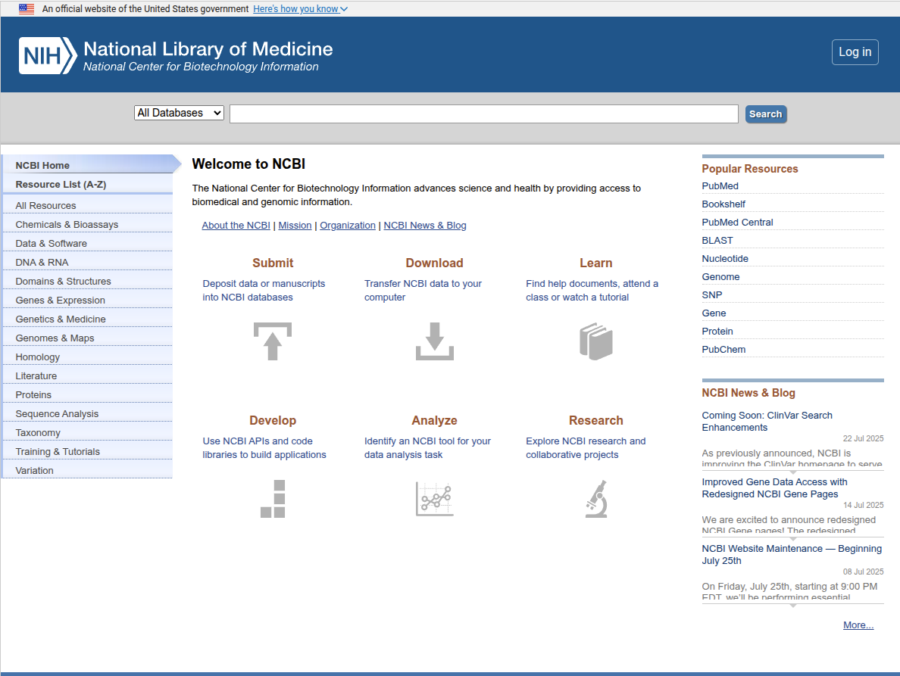
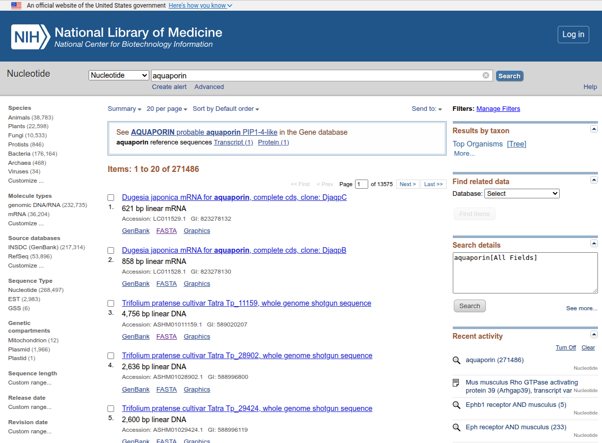
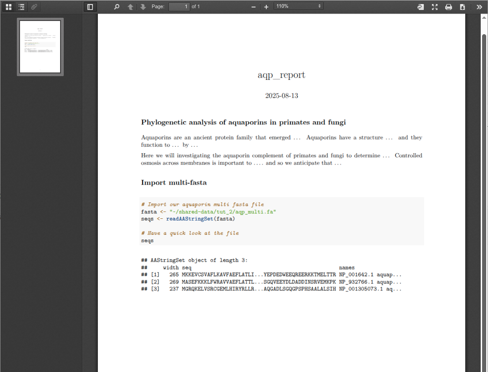

# Introduction to NCBI and other biological databses

Today we are going to get introduced to biological databases, but before that, I want to talk about the next five tutorials and the assessment piece due in week 6. The tutorials in weeks two to five are designed to build upon each other to develop a body of work that will be presented in week six. While each student will work independently and will submit their own pieces of assessment in week six, along the way we will work as a group to learn from each other and to help each other out so everyone is strongly encouraged to communicate with each other, both in these practical sessions and outside them if desired. 

The overarching idea is for each student to investigate a particular gene family, looking at how copies of those genes are related to each other within an individual species and also between them. Each student will be assigned a gene family and it's your responsibility to get familiar with them throught the course of the next few weeks. Today we will be using online databases to search for our gene sequences of interest, and next week we will be using search tools to identify further orthologues. In week four we will learn about multiple sequence alignment (MSA) and we will create MSAs of our gene families so that in week six, we can use phylogenetic approaches to determine how the different genes in our gene families relate to one another.

This exercise will follow a basic workflow that is very commonly used in a range bioinformatic endeavours. While we will be using a specic set of tools to acheive our aims, there is an enormous variety of tools and methods out the to achieve the same basic end goals that we are aiming for, so if you have familiarity with any of the steps we will be pursuing, you will be encouraged to try out new tools along the way.

Over the course of these four weeks, you will be performing analyses in R and by using command line tools that be executed from the Bash shell. You will be required to document all of these steps in an R Markdown document that incorporates explanatory text, code that takes in data and processes, and code that plots results. 

In week six you will submit this document for assessment and will be required to give a 5-10 minute presentation on your gene family and what you found through your analysis. The document should take on a form of something between a lab book and a scientific report and while it shouldn't be quite as formal as a published scientific paper, it will be assessed on the logical flow of ideas, the quality of the commenting of code, the depth and quality of analysis and the readabilty and reproducibility. Getting a nice final result will be a bonus but given that we don't yet know how difficult it will be to get a good result from each particular gene family, this should be a secondary consideration. As long as your methodology is sound, whether or not the final result is nice and clean is of less importance. It's possible that you might be assigned a particularly troublesome gene family so it wouldn't be fair for you to be penalised compared to someone else who might have a super compliant gene family. In a way, this will be a true research project as I genuinely don't know how each will turn out!

AAAlright, **databases**.

Over the years, scientists have generated incredible amounts of sequence data. When deciding what to do with data you've generated, one option would be to keep it on a hard drive in a drawer in your desk accessible only to you, but this would likely cause you a range of problems. Here's a list of issues you'd encounter.

1. Data preservation and security
 - You drawer is a single point of failure. Natural disasters, theft or human error could lead the loss of the only copy of the data
 - Bit rot. All storage media eventually degrades. Without active management, this will lead to data loss.
 - Privacy conerns. If your data is from patients, loss or theft of the drive could lead to serious ethical violations, especially if it is identifiable.
2. Data Volume
 - Maybe the first hard drive or two isn't an issue, but before long, even individual labs can now produce so much data per year that physical storage of drives becomes an issue. Desk drawers are only so big!
3. Search and Discovery
 - Going back through old disks, especially if they were created by someone else can be a nightmare.
 - There is very often a lack of documention to go with individual disks to describe where everything is, how bits of data relate to one another and how samples across disks might relate.
4. Data Accessibility and Sharing
 - Probably the biggest issue. How can anyone else access your data? How do you share it with colleagues?
 - Poor data accessibility is often the root cause of the well documented 'reproducibility crisis' in science.
 - If others can't verify your work using your data then you may as well have not done the work.
 - "Trust me bro" is not a sound scientific approach.
 
This is why we have databases. Around the world, many institutes and government organisations have set up databases dedicated to storing and indexing biological datasets, and on top of these they have built tools for search, retreival and many other functions. The first database we will look at today is the National Centre of Biological Information (NCBI) database which is a subsidury of the National Institute of Health (NIH) in the US. NCBI is actually a huge collection of databases, each with a unique focus, but all of which are accessible from a single centralised website. [Click here](https://www.ncbi.nlm.nih.gov/) to get started.
 
 
 
Let's try a search together. In the box at the top, type in `aquaporin` and hit enter. On the left you might notice a dropdown box where you can select the database your want to search but for now, let's just leave it set at `All Databases`. Aquaporin is a gene family that encodes proteins that allow water to pass across cell membranes. It often forms tetramers (four of the same protein interacting with one another) and it's just pretty. Look at this thing!

<div align="center">

 
 
 </div>
 
On the next page you'll see all the hits you got for aquaporin in each of the databases hosted by NCBI. For now we are interested in the `Nucleotide` database which houses individual gene sequences. At the time that I'm writing this, there are 271,486 hits for aquaporin in this database but this may change by the time you see it. Click it to see all the hits.
 
 
 
On the right hand side you'll see `Results by taxon`. Click on `[Tree]` to get a phylogenetic representation of all the aquaporin hits in the database. Aquaporins are ubiquitous across the tree of life and so have evolutionary roots that predate the divergence of the three domains of life - bacteria, archaea and eukaryotes. Click on `chordates` and then keep clicking through the tree until you get to `primates`. To narrow it down even further, add `AND Homo` to the search term so that in the end it should read:

`((aquaporin) AND "chordates"[porgn:__txid7711]) AND "primates"[porgn:__txid9443] AND Homo`

At the time of writing, I'm getting 936 hits but there are not 936 different aquaporin genes in humans. This highlights the redundancy and low level of curation of the database. Anyone can add sequences to the `Nucleotide` database and so you will find a mix of complete gene sequences, partial gene sequences, gene isoforms and also occasionally a mis-identified sequence. Humans have 13 different aquaporin genes (AQP0-13) that all have unique expression profiles and functions. Click on one of the hits to bring up the entry for it. Here you will see a two column text file known as `genbank format`. This provides a lot of information about the gene, the organism from which it was sequenced, the authors who published it, any papers associated with the gene and also the gene and amino acid sequence. In the `CDS` section, there is a link to the `protein_id` which cross references the protein sequence.

At the top of the protein page, click the `FASTA` link. This should be a format more familiar to you.

### Multi Fasta Creation

Our next task is to create a multi fasta file on our server that consists of protein sequences for all 13 human aquaporins. Once we are done this, we will need to do the same for a closely related primate species - say for chimpanzee or gorilla, so that in the end, our multi fasta should have about 26 sequences in it. This will be the beginning of your project which will be completed by week six. Once we all have a complete set of primate aquaporin sequences, I will assign a comparison taxa to each student and so your final goal will be to build a phylogenetic tree comparing the complement of aquaporins in primates to your designated taxa. There are a lot of steps involved in this and so we will be stepping through them together but in the end, we should end up with unique reports analysing the aquaporing complement of a variety of taxa. 

To create your multi fasta, `ssh` into the server and begin to create a directory structure for your project. At login you should be in your home directory so consider creating a project folder and within that, creating a folder called `data`. For this you will need to use the `pwd`, `cd` and `mkdir` commands we learnt last week. Once you are in your data directory, use `vim`, `emacs` or `nano` to create a new file called `multi_fasta.fa` and in here you can paste your fasta sequences, one after the other.

Continue adding fastas to this file until you have all 26 primate aquaporin sequences in it. Once this is done, let the tutor know so that you can have your comparison taxa assigned to you. There is a very good chance that we (the tutors) will not know much about the aquaporin gene complement of your assigned taxa so it will be up to you to do a bit of research to work out how many aquaporin genes you should expect to have to identify. There may also be issues to do with differences in nomenclature that will complicate things, as well as the issues of redundancy and bad annotation that we've already mentioned. Your tutors will be able to help out with how to go about sampling the approriate genes even if they don't know anything about the gene family itself, so please ask questions and make sure you understand exactly what is being asked of you.

When collecting your primate sequences, you could try the [RefSeq](https://www.ncbi.nlm.nih.gov/nuccore) database which is a more curated version of the NCBI `Nucelotide` database. Another option is the European counterpart to the US NCBI, [EMBL-EBI](https://www.ebi.ac.uk/). These results pages have a completely different structure to the NCBI genbank format and provide plenty of other sources of information. When collating your multi-fasta, ensure you are only including one copy of each gene as redundancy here will impact our results over the next few weeks. If you choose to search the `protein` database from the EMBL-EBI site, you will actually be searching [UniProt](https://www.uniprot.org/) which is the premier European protein database.

### Notebooks

Before leaving today, make sure you get your project notebook kick started. In RStudio, you can click `File`, `New File`, `R Markdown` to create a new R Markdown object, but for now it's probably best to switch to the command line and make your own copy of an example doc that I've created in `~/shared-data/tut_2/report_example.Rmd`. 

To do this, navigate to to your `~/working-directory`, create a new folder called `reports` or something similar and then copy the `report_example.Rmd` file to this new directory. You can then open and edit this file in RStudio.

At the top of this doc, you'll see an `output` line which specifies that this file will create a pdf doc. This can also be switched to html but for our purposes, pdf is best. This is followed by two code chunks which set up the environment and includes instructions for knitr and which libraries to load.

Below this you can introduce your project and then start adding code blocks to import your fasta etc. Here's a screenshot of the beginnings of my example report. By the time we get to week six, this should be fleshed out into a complete report which you will submit for assessment. REMEMBER: Make sure to save your R Markdown file to an appropriate location within your `~/working_directory`. 

When you're happy with your report, you can hit the `Knit` button at the top of your rmd file pane which should save the file and create your pdf report which will be saved to the same location as your rmd file.



### Downloading files to your local computer
One last thing we need to learn today is how to transfer files between our Nectar instance and our own computers. The easiest way to do this is to use the `scp` (secure copy) command on the command line on our own computers. First, navigate to the location on your computer where you want to download your pdf report to and then type in the following command:

```bash
scp test_user_1@bioinformatics.nec-mf-proj01.cloud.edu.au:/home/test_user_1/working-directory/report_example.pdf ./
```

Make sure you modify the script so that you use your own username instead of test_user_1 that is written here. This script runs the scp command to access our server using your username. It then looks for the specified file in the specified location and then saves it to our local machine at the current location as specified by `./`.

In order to do the reverse and upload a file from our local machine to the server, use `scp` like this:

```bash
scp report_example.pdf test_user_1@bioinformatics.nec-mf-proj01.cloud.edu.au:/home/test_user_4/working-directory/
```

Alternatively, there are GUIs out there such as FileZilla and Cyberduck which can be setup to access an ssh server for transferring files. If you prefer one of these, you can have a read about them [here](https://tutorials.rc.nectar.org.au/moving-data/01-overview).
