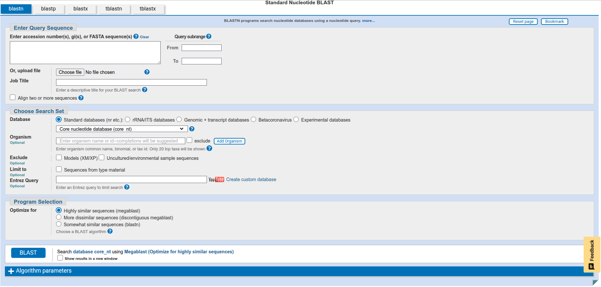
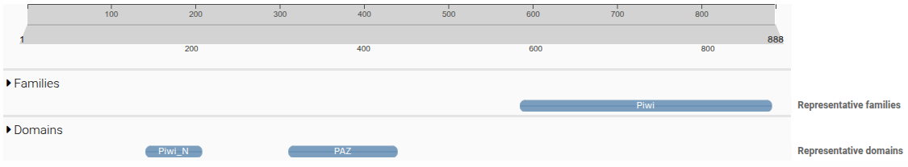
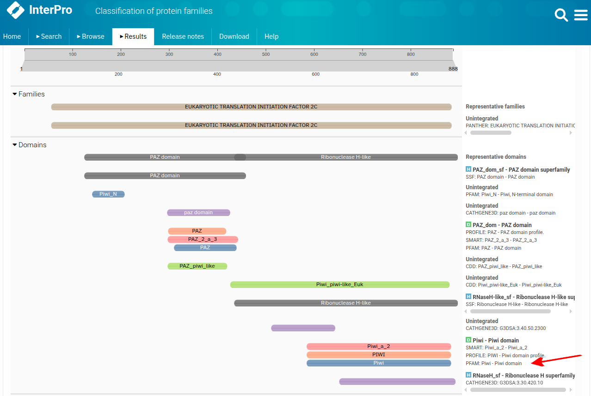
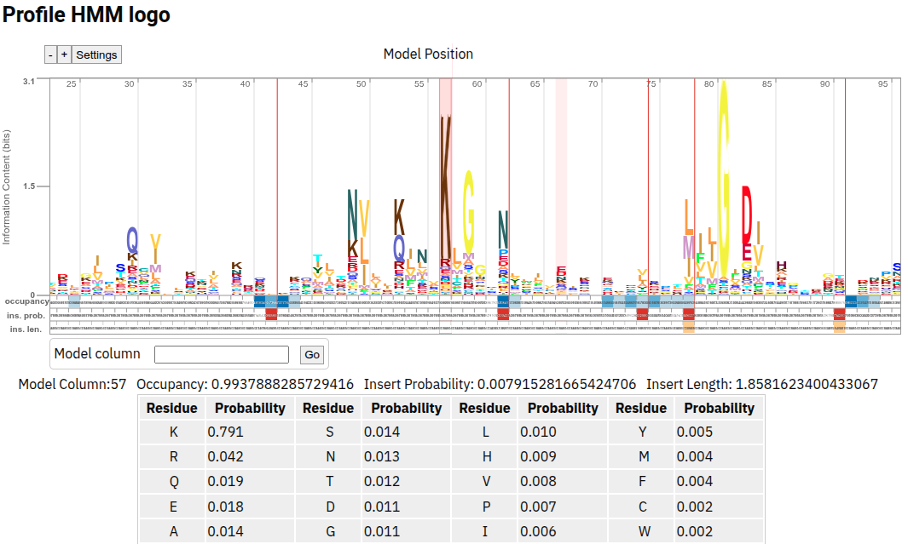
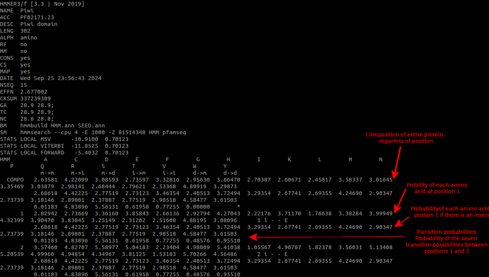

# Basic Local Alignment Search Tool (BLAST) and Hidden Markov Models (HMMs)

Last week we learnt about the NCBI and other biological databases. These are extremely useful tools for obtaining sequence data but so far we've been limited to only using text searches to identify sequences based on metadata. This limitation is a problem for a number of reasons:

1. Not all sequences in NCBI are annotated correctly.
  - Despite best intentions, scientists do sometimes make mistakes when it comes to sequence identification.
2. Not all metadata are accurate.
  - Again, people sometimes make mistake when annotating sequences. This could be in mis-identifying the species sequenced (believe me, more common than you might expect), misidentifying the particular orthologue of a complex gene family (even more common) and any number of other mistakes.
3. Some metadata could be missing.
  - There may be some aspect of the gene biology that you are interested in that has not been recorded, ie. protein domain structure (we'll get more in to this soon).
  
For these reasons and many more, a sequence search tool would be preferable in many circumstances to a text based search system. Fortunately for us, this need was identified long before most of you were probably born.

In 1990, Altschul et al. published **Basic local alignment search tool** in the Journal of Molecular Biology which is a journal with an impact factor of 4.7. At last count, this paper has had 74,708 citations making it their most cited paper by a factor of over 2.5x. This paper described an algorithm they developed to efficiently take a query sequence and search it against a database of sequences of arbitrary size. You've had a lecture on the BLAST algorithm so I won't repeat the details of its architecture here but today we are going to try out some practical examples to get you familiar with how to use it in your work.

## Online BLAST GUI

Click [here](https://blast.ncbi.nlm.nih.gov/Blast.cgi) to go to the BLAST main page. Here you'll see links to four flavours of the algorithm.

1. Nucleotide BLAST
  - Uses a nucleotide sequence to search against a nucleotide database.
2. Protein BLAST
  - Uses a protein (amino acid) sequence to search against a protein database.
3. blastx
  - Uses a nucleotide sequence to search against a protein database.
  - This is more computationally demanding and so slower than options one and two as it needs to first translate your nucleotide sequence into all six possible reading frames and then conduct searchs of the protein databse with all six translated query sequences.
4. tblastn
  - Uses a protein sequence to search against a translated nucleotide database.
  - Also computationally demanding as it requires the creation and search of a translated nucleotide database which is 6x the size of a regular nucleotide database.

### BLASTn
First up, we'll try out a nucleotide search so click on `Nucleotide BLAST`. At the top you'll see a box to enter a query sequence. 



Switch across to your terminal and navigate to `~/shared-data/tut_3/seqs` and have a look at the contents of the file called `piwi_nt.fa`. Copy and paste this sequence into the BLAST query box. You'll notice that there are a stack of options here for tailoring your search:

1.  `Query subrange` allows you to select a subset of your sequence by giving a numerical range to define which nucleotides to consider.
2.  `Database` allows you to choose what to search against. There are lots of options here but typically we go with `core_nt` or `nr/nt` or one of the `refseq` options.
3.  `Organism` allows you to restrict your search to a single or small number of species.
4.  `Exclude` and `Limit to` are not really relevant to us.
5.  `Entrez Query` is if you want to use the syntax of `Entrez` to restrict your search. Entrez is the NCBI search and retrieval system at the core of NCBI but which is usually abstracted away by interfaces such as this one.
6.  `Optimize for` allows you to choose an algorithm that best suits your search. It is generally best to use a more targeted option like `megablast` to begin with but if you find you are not getting hits to more distantly related sequences that you were expecting, consider switching to `blastn`.

If you then click the `+` symbol next to `Algorithm parameters`, you'll see a few options that I hope you recognise from your lecture on alignments:

1.  `Max target sequences` sets the maximum number of hits to report.
2.  `Short queries` should be toggled on for BLASTing short seqences.
3.  `Expect threshold` sets the maximum e value for a hit to be reported. Default is set at 0.05 but we often use 1e-6 if we are trying to be conservative.
4.  `Word size` refers to the length of the seed that initiates an alignment and extention.
5.  `Match/Mismatch Scores` sets the scoring paramers for a blastn query.
6.  `Gap Costs` determines how much the alignment score will be penalised for opening and extending a gap.
7.  `Filter` allows you to exclude hits to low complexity regions (repeats) or for species-specific repeats.
8.  `Mask` allows you to avoid getting initial seed hits to low complexity regions. There is also an option to mask lower case letters as sometimes lower case letters are used to define low complexity regions.

For your first go, stick with the defaults and click `BLAST` at the bottom. At the time of creating this, the result should be six hits. The top hit is to a `Hydra vulgaris` sequence. You can click on the species name to learn more about it. Looking at the hits, you can see the following columns:

1.  `Max Score` shows the score of the single best alignement between the two sequecnes. Remember that there may be more than one region of alignment between two sequences that are separated by regions that can't be aligned.
2.  `Total Score` shows the sum of all alignment scores between the two sequences.
3.  `Query Coverage` indicates what percentage of your query sequence aligned to the target sequence.
4.  `E value` is the `expect value` which tells you how many alignments you would expect with this score or better, purely by chance.
5.  `Percent Identity` indicates how similar the two sequences are.
6.  `Accession Length` indicates the length of the target sequence.
7.  `Accession` provides an accession code and link to the target sequence.

All the hits we get here gave extrememly low e values (zero is as good as it gets), indicating a high likleihood that the results are non-random, however there are large differences in the scores and query coverage values between the top and bottom hits.

Spend some time having a look at these alignments by clicking on the hits and also the tabs and the top of the results table. Ask plenty of questions and get familiar with how BLAST results are presented.

### BLASTp
To do a BLASTp search, we need a peptide sequence. To do this, click on the `Accession` link for the top BLASTn hit. This will take you to the `Genbank` file for that sequence and if you scroll down, you'll see an entry called `protein_id`. This links to the genbank file for the translated amino acid sequence of this nucleotide sequence. Once you are there, click on `FASTA` at the top and then copy the resulting sequence.

Back on the BLAST page, click the `blastp` tab at the top of the page and paste in your amino acid sequence. You'll notice plenty of options to modify your search parameters here too. Some are similar to those you saw under `blastn` but others are unique. Under `Algorithm paramaters`, the most important option to point out is `Matrix`. If you remember back to your BLAST lecture, while seed alignment scoring in BLASTn is a fairly simple matter of determining whether you have a match or mismatch, protein blast searches use a more sophisticated scoring martrix, the most common option of which is `BLOSUM62`. 

One other thing worth pointing out, in August 2025, NCBI switched from using the `Non-redundant protein sequences (nr)` database as the default Database option to using the `ClusteredNR` database. This change means that rather than reporting every individual hit to the nr database, your result will report hits to clusters of very similar proteins from the nr database. This should result in a more diverse set of reported hits as very similar proteins are now reported as single clusters.

Have a look around at all the ways you can customise your search and when you are done, click `BLAST` to get your results.

The first thing you'll notice is that there are a lot more reported hits here compared to the blastn result. Have a think about why this might be (*hint* consider the redundancy of the genetic code).

## BLAST on the command line
While the online option is great, if you want to run lots of searches or you want to search against a custom database, then you'll need to move to the command line. In this next exercise, we are going to make our own blast databases from fasta files of the human transcriptome, and then use our `piwi` fastas to search for similar sequences in humans.

First thing, move to your ~/working_directory and create the following folders:

```bash
test_user_1@bioinfo:~/working-directory$ mkdir -p tut_3/blastdb/nt
test_user_1@bioinfo:~/working-directory$ mkdir -p tut_3/blastdb/pep
```

This is where we are going to store out nucleotide and peptide databases. Move into the nucleotide database so we can start to build it. For your convenience, I have already downloaded the transcriptome fasta files from the [Ensembl](https://ftp.ensembl.org/pub/current_fasta/homo_sapiens/) website and put them in the `~/shared-data/tut_3/human_transcriptome/` directory. I have also preinstalled the various BLAST programs from [NCBI]( https://ftp.ncbi.nlm.nih.gov/blast/executables/blast+/LATEST/) so to use the programs, you just need to type their names into the command line. Firstly, try bring up the help menu for `makeblastdb` which is the program for making blast databases from fasta files:

```bash
test_user_1@bioinfo:~/working-directory/tut_3/blastdb/nt$ makeblastdb -help
USAGE
  makeblastdb [-h] [-help] [-help-full] [-in input_file] [-input_type type]
    -dbtype molecule_type [-title database_title] [-parse_seqids]
    [-hash_index] [-mask_data mask_data_files] [-mask_id mask_algo_ids]
    [-mask_desc mask_algo_descriptions] [-gi_mask]
    [-gi_mask_name gi_based_mask_names] [-out database_name]
    [-blastdb_version version] [-max_file_sz number_of_bytes]
    [-metadata_output_prefix ] [-logfile File_Name] [-taxid TaxID]
    [-taxid_map TaxIDMapFile] [-oid_masks oid_masks] [-version]

DESCRIPTION
   Application to create BLAST databases, version 2.17.0+

REQUIRED ARGUMENTS
 -dbtype <String, `nucl', `prot'>
   Molecule type of target db

OPTIONAL ARGUMENTS
 -h
   Print USAGE and DESCRIPTION;  ignore all other parameters
 -help
   Print USAGE, DESCRIPTION and ARGUMENTS; ignore all other parameters
 -help-full
   Print USAGE, DESCRIPTION and ARGUMENTS, including hidden ones; ignore all
   other parameters
 -version
   Print version number;  ignore other arguments

 *** Input options
 -in <File_In>
   Input file/database name
   Default = `-'
 -input_type <String, `asn1_bin', `asn1_txt', `blastdb', `fasta'>
   Type of the data specified in input_file
   Default = `fasta'

 *** Configuration options
 -title <String>
   Title for BLAST database
   Default = input file name provided to -in argument
 -parse_seqids
   Option to parse seqid for FASTA input if set, for all other input types
   seqids are parsed automatically
 -hash_index
   Create index of sequence hash values.

 *** Sequence masking options
 -mask_data <String>
   Comma-separated list of input files containing masking data as produced by
   NCBI masking applications (e.g. dustmasker, segmasker, windowmasker)
 -mask_id <String>
   Comma-separated list of strings to uniquely identify the masking algorithm
    * Requires:  mask_data
    * Incompatible with:  gi_mask
 -mask_desc <String>
   Comma-separated list of free form strings to describe the masking algorithm
   details
    * Requires:  mask_id
 -gi_mask
   Create GI indexed masking data.
    * Requires:  parse_seqids
    * Incompatible with:  mask_id
 -gi_mask_name <String>
   Comma-separated list of masking data output files.
    * Requires:  mask_data, gi_mask

 *** Output options
 -out <String>
   Name of BLAST database to be created
   Default = input file name provided to -in argumentRequired if multiple
   file(s)/database(s) are provided as input
 -blastdb_version <Integer, 4..5>
   Version of BLAST database to be created
   Default = `5'
 -max_file_sz <String>
   Maximum file size for BLAST database files
   Default = `3GB'
 -metadata_output_prefix <String>
   Path prefix for location of database files in metadata
 -logfile <File_Out>
   File to which the program log should be redirected

 *** Taxonomy options
 -taxid <Integer, >=0>
   Taxonomy ID to assign to all sequences
    * Incompatible with:  taxid_map
 -taxid_map <File_In>
   Text file mapping sequence IDs to taxonomy IDs.
   Format:<SequenceId> <TaxonomyId><newline>
    * Requires:  parse_seqids
    * Incompatible with:  taxid
 -oid_masks <Integer>
   0x01 Exclude Model
```

So you can see there are a LOT of things you can tweak here. Don't worry, you aren't expected to know every single parameter here. We will now walk through an example of how to make a blastn database for searching nucleotide sequences and then afterwards, you can have a go yourself at producing a protein database for blastp.

```bash
test_user_1@bioinfo:~/working-directory/tut_3/blastdb/nt$ makeblastdb -dbtype nucl -in /data/shared-data/tut_3/human_transcriptome/nt/Homo_sapiens.GRCh38.cdna.all.fa -input_type fasta -parse_seqids -hash_index -out human_nt
```

I this command, we defined the database type (nucleotide), the input fasta sequence from which the database will be built (Homo_sapiens.GRCh38.cdna.all.fa), the input type (fasta) and the output filename prefix (human_nt). We also included the flags `-parse_seqids` and `-hash_index` which will firstly tell `makeblastdb` to use the sequence ids in the input file rather than internally created identifiers, and secondly, will create a lookup hash index. Together, these allow you to extract sequences from the database using the sequence ids, but we will come to this in a bit.

We can now use this database to find alignments between an input sequence and those making up the human transcriptome. Run `blastn -help` to get a list of the options available for blastn. Have a go at creating your own blastn script to find genes with similarity to the piwi sequence you have in `~/shared-data/tut_3/seqs`. In this directory you will find two nucleotide sequences, one from a sperm whale and one from a hydra (cnidarian). Try both out and compare your results. Try modifying the e value to see how this impacts things. While you can experiment with which other parameters to modify, make sure you use these at a minimum:

```bash
-query  - Your input fasta file (piwi_nt.fa for this example)
-db     - The blastn database you created. For me, this should be human_nt
-out    - Path and name of the output file created
-evalue - Maximum e value for a reported hit (try 1e-6)
-outfmt - The file format you want for your output. Try option 6, 7 or 10 to begin with
```

While you are thinking about your results, have a go at building a human protein blast database and try the `*_pep.fa` sequences too. Follow the steps we used to create the blastn database above and discuss how your results differ between the blastn and blastp runs.

One other thing that a blast database can be used for is retrieving sequences if you know what's in the header. Have a go at this `blastdbcmd` command:

```bash
test_user_1@bioinfo:~/working-directory/tut_3/blastdb/nt$ blastdbcmd -db human_nt -entry ENST00000632136.1
>ENST00000632136.1 cdna scaffold:GRCh38:HSCHR7_2_CTG6:814667:816341:1 gene:ENSG00000281981.2 gene_biotype:TR_C_gene transcript_biotype:TR_C_gene gene_symbol:TRBC1 description:T cell receptor beta constant 1 [Source:HGNC Symbol;Acc:HGNC:12156]
AGGACCTGAACAAGGTGTTCCCACCCGAGGTCGCTGTGTTTGAGCCATCAGAAGCAGAGATCTCCCACACCCAAAAGGCC
ACACTGGTGTGCCTGGCCACAGGCTTCTTCCCCGACCACGTGGAGCTGAGCTGGTGGGTGAATGGGAAGGAGGTGCACAG
TGGGGTCAGCACGGACCCGCAGCCCCTCAAGGAGCAGCCCGCCCTCAATGACTCCAGATACTGCCTGAGCAGCCGCCTGA
GGGTCTCGGCCACCTTCTGGCAGAACCCCCGCAACCACTTCCGCTGTCAAGTCCAGTTCTACGGGCTCTCGGAGAATGAC
GAGTGGACCCAGGATAGGGCCAAACCCGTCACCCAGATCGTCAGCGCCGAGGCCTGGGGTAGAGCAGACTGTGGCTTTAC
CTCGGTGTCCTACCAGCAAGGGGTCCTGTCTGCCACCATCCTCTATGAGATCCTGCTAGGGAAGGCCACCCTGTATGCTG
TGCTGGTCAGCGCCCTTGTGTTGATGGCCATGGTCAAGAGAAAGGATTTCTGAAGGCAGCCCTGGAAGTGGAGTTAGGAG
CTTCTAACCCGTCATGGTTTCAATACACATTCTTCTTTTGCCAGCGCTTCTGAAGAGCTGCTCTCACCTCTCTGCATCCC
AATAGATATCCCCCTATGTGCATGCACACCTGCACACTCACGGCTGAAATCTCCCTAACCCAGGGGGACCTTAGCATGCC
TAAGTGACTAAACCAATAAAAATGTTCTGGTCTGGCCTGA
```

This rapidly retrieves the sequence corresponding to our query of `ENST00000632136.1`.

## InterPro

As we learnt in the last lecture, the key to a protein's function lies in its shape and its distribution of charges. In lecture 7, we will learn about the modularity of proteins and their architectural organisation into 'domains'. These domains perform specific and conserved roles in proteins and are frequently rearranged over evolutionary time to create various configurations that carry out specific roles.



We can investigate the protein domain architecture using an online tool called [InterPro](https://www.ebi.ac.uk/interpro/) which collates a number of databases which have been produced over the years for protein domain annotation. On the front page, you will see options to search by text, by domain architecture or be sequence. As we want to investigate what is going on in our sequences, choose `Search by sequence` and paste in one of the amino acid fasta files you have in `~/shared-data/tut_3/seqs`. Click `Advanced options` to see the list of databases that InterPro integrates and then click `Search` when you are ready. On the next page, click the sequence name once the search is complete.

On the results page, you will see a bunch of coloured boxes with protein domain names in them. There is a lot of redundancy here because most of the domain architecture tools identify similar protein domains, even though they all use unique methodologies to do so. 



Click the `PFAM` link to the `Piwi domain` indicated by the red arrow. This will take you to a page that gives you a description of the domain, but also provides details on how the domain was defined. 

Recall from the lecture that protein domains are defined by Pfam using a `Hidden Markov Model`. An `HMM` is a matrix of probabilities of seeing any of the 20 amino acids at each location in an alignment. Click on `Profile HMM` to see a HMM logo of the Pfam Piwi domain.



Like with BLAST, we can use hidden markov models to identify proteins containing specific domains on the command line. Switch over to your terminal and create a new folder in your `~/working-directory/tut_3` for this, giving it a logical name and if need be, create new folders within this for different searches. It's up to you how you control your directory structure but it is very important that it follows a logical system and is readable by others, and by your future self.

### HMM search on the command line 
The next thing we need to do is to obtain a raw HMM to use to search our proteome. Go back to the InterPro page and under `Profile HMM` right click on the `Download` link and click `copy link address` in Chrome or `copy link` in Firefox. Now in your R, start creating the download command like this:

```R
setwd("~/working-directory/tut_3/hmmsearch")
url <- "INSERT_YOUR_URL_HERE"
```

The `setwd()` command sets your working directory so R downloads to the correct location. Now go back to your browser, right clink on `Download` again and click `inspect element` in Chrome or `inspect` in Firefox. You'll now see a highlighted line of code that includes `PF02171.hmm.gz`. Copy just this part and add it to your download command so that it now looks like this:

```R
setwd("~/working-directory/tut_3/hmmsearch")
url <- "INSERT_YOUR_URL_HERE"
destfile <- "PF02171.hmm.gz"
download.file(url, destfile)
```

You can now execute this command to download the HMM. To inspect it within R, try the following:

```R
PF02171 <- gzfile("PF02171.hmm.gz", "rt")

# Read first 30 lines
lines <- readLines(gzfile("PF02171.hmm.gz"))
```

Alternatively, you can do the same with bash. Go to your terminal and type the following but don't hit enter yet:

```bash
wget INSERT_YOUR_URL_HERE
```

Now go back to your browser, right clink on `Download` again and click `inspect element` in Chrome or `inspect` in Firefox. You'll now see a highlighted line of code that includes `PF02171.hmm.gz`. Copy just this part and add it to your wget command like this:

```bash
wget "INSERT_YOUR_URL_HERE" -O PF02171.hmm.gz
```

You can now hit enter. wget is a command to download files from the internet to your current location. When a URL links directly to a filename, you don't need to include the `-O` option but as this URL points to an API endpoint, you do need to give wget a name to save the file as.

As this file is gzipped, you can't just inspect it directly, for example with `cat`. Instead, try using `zcat` and then pipe the output to `less`.



You don't need to memorise ever component of this file format but it is good to understand the broad concept that an HMM is a large matrix describing the *probability* of finding any particular amino acid at each specific location. 

Now we can use the pre-installed `hmmsearch` command to identify Piwi domain containing peptides in our transcriptome. While this is done using the Bash shell, remember that you can run these sorts of scripts within R using the `system()` command. An example will be provided below.

On the command line, navigate to the hmm folder you created earlier and then run `hmmsearch -h` to see all the options available. At the top you will see the basic usage instructions:

```bash
Usage: hmmsearch [options] <hmmfile> <seqdb>
```

This tells you that to run hmmsearch, at a minumum you require an hmmfile (the file we downloaded from InterPro) and a seqdb which is just a protein fasta file. Have a go at constructing your own hmmsearch command but make sure to include `-o` to define an output file as well as `--tblout` to define a per-sequence hit output table.

Examine both output files. Use your bash scripting or R skills to create lists of protein identifiers (those starting with `ENSP`), transcript identifiers (those starting in `ENST`) and gene identifiers (those starting in `ENSG`). How many of each did it find? Inspect the e-values. Are there any outliers?  What parameters would you modify if you were to run this search again?

It is also possible to download the entire Pfam HMM database and then use the command `hmmscan` to identify all protein domains withing a protein of interest, although we might only try this out if we have the time.

### Self guided sequence searches

So far today we have conducted BLAST searches and hmm searches of the human transcriptome using hydra and sperm whale PIWI sequences, however for your project, your task is to identify `Aquaporin` sequences in two phylogenetic lineages. Last week we did a bunch of database searches using text inputs to populate our gene lists but this can lead to false negatives where certain sequences are missed. For the rest of the tutorial, your task is to use BLAST and hmmsearch to identify candidate aquaporin genes from the species you will be comparing. As you identify genes, remember to append them to the multi-fasta we created last week. If you need to download a transcriptome for your species, try [ensembl](https://www.ensembl.org/index.html) for vertebrates or [ensembl metazoa](https://metazoa.ensembl.org/index.html) for inverts.

It is also super important to ensure that you are documenting everything in your RMarkdown document! You should include all the code you use there, descriptions of what you are doing and why, and where you obtained data from! 