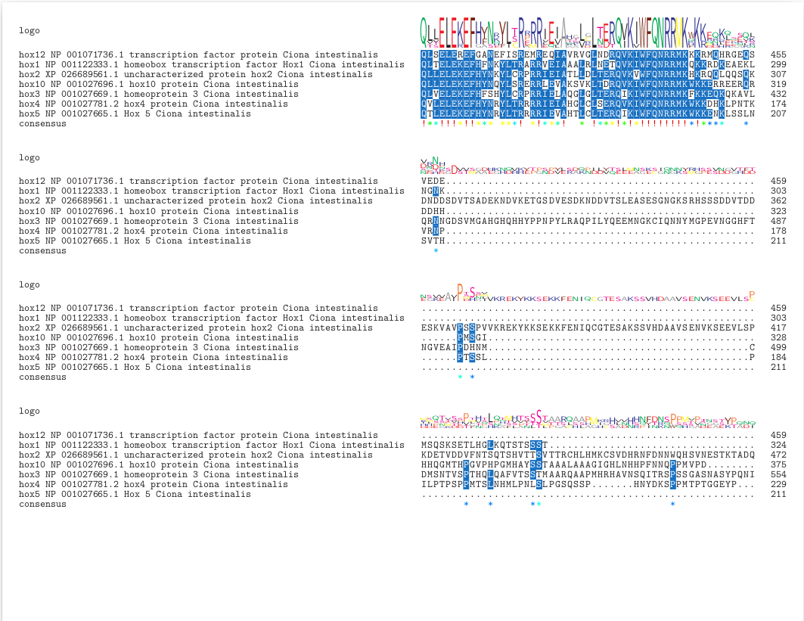

# Multiple sequence alignment

By this stage you should have created a multi fasta file containing the amino acid sequences of all the genes in your allocated gene family from at least four species. Today we are going to take that fasta file and use it to create a multiple sequence alignment (MSA) which we will be able to use subsequently as input for phylogenetics.

Today we will be trying to do as much as we can in R so make sure to write all your code and comments into your RMarkdown document. Remember, this document will be assessed and it should be completely understandable as a stand along document by an external reader. For that reason, it is extremely important that you give sufficient details at every step about what you are doing and why. If you are importing a file that you created outside of this document (ie. your multi fasta), you should write a paragraph or two explaining what the file is that you are importing and how it was created. For all code, make sure you comment it well using comment lines (# Followed by a comment).

As we will be operating out of our working directory in R, make sure you setwd() correctly. You'll also need to create a new directory for all your MSA files.

```R
setwd("~/working-directory/phylogenetics_project")
dir.create("msa")
```

Next you'll need to import your fasta file and use this to create an AAStringSet object, which is a data structure native to the `Biostrings` package used for efficient further processing. As we are using the `Biostrings` package, you'll first need to load it. I like to have a code chunk right at the top of my RMarkdown document where I import all the libraries I'll need at the beginning. As you don't want to mess your final pdf file up with unnecessary output text, I would set `echo` to TRUE and `include` to FALSE.

```R
# Load library
library(Biostrings)

# Import fasta
fasta <- "seqs/aquaporins_mollusc.fa"
seqs <- readAAStringSet(fasta)

# Have a quick look to see if it has imported correctly.
seqs
```

Now we are ready to perform our first alignment. For our first attempt, we are going to use the `msa` package from within R but later we'll try another package called `MAFFT`. As it runs in the shell though, rather than in R, we'll either need to switch over to the command line for this or wrap it in a system command within R. But, I digress. Back to `msa`!

```R
# Load library
library(msa)

# Perform the alignment. Try Muscle algorithm first, but other options are ClustalW and ClustalOmega
aligned <- msa(seqs, method="Muscle")

# Have a look at the alignment
aligned

# Convert to AAMultipleAlignment for further analysis
aligned_aa <- as(aligned, "AAMultipleAlignment")

# Have a look at the AAMultipleAlignment object
aligned_aa

```

This package also allows us to modify parameters of the algorthm (ClustalW, ClustalOmega, Muscle) such as the `gap opening penalty`, the `gap extention penalty` etc, but it also allows for different substitution matricies. Have a go and see if you get major differences using a matrix other than the BLOSUM62 default:

"BLOSUM30", "BLOSUM40", "BLOSUM50", "BLOSUM62", "BLOSUM80", "PAM30", "PAM70", "PAM120", "PAM250"

```R
# Load the matrix you want to try from the Biostrings package
data("BLOSUM100")

# Rerun the alignment using the new substitution matrix
aligned_BLOSUM100 <- msa(seqs, method="Muscle", substitutionMatrix = BLOSUM100)
```

So far, everything we have done has created objects that are stored in memory only. It's a good idea to save the alignment file so that we can use it later, in particular if we want to use the alignment with packages outside of R. Make sure you give it a good name so its clear how it was created in the first place.

```R
# Write the alignment to a file
writeXStringSet(AAStringSet(aligned_aa), "msa/msa_muscle_aligned_sequences.fa")
```

You can also generate a pretty pdf of your alignment using another command from the Biostrings package. The issue with this is that `msaPrettyPrint` has a bug where it will save the metadata text file in the correct location that you specify in your command, but no matter what you do, it will save the pdf in your working directory. You can either temporarily change your working directory to wherever you want to save the pdf to using `setwd()`, or you can just move the pdf after its created.

```R
# Generate PDF with custom name
msaPrettyPrint(aligned_aa, file="msa_muscle_alignment.pdf", askForOverwrite=FALSE)

```



Now lets try MAFFT on the command line. Either switch to the `Terminal` tab in RStudio or open up your terminal window and ssh into the server.

```bash
mafft --help
```

You can see a few options there and also a few example scripts of how you might use it. We want to do a local alignment (remember the difference between local and global alignments from the BLAST lecture?) but mafft gives us the option of using either `--localpair` or `--genafpair`. Both of these are local alignment algorithms but `--genafpair` uses a more complicated gap open and extend penalty calculation than the standard local alignment option. This means `--genafpair` can be better for alignments of genes that include very conserved domains combined with very divergent regions but keep in mind, it is more computationally expensive than `--localpair`.

Move into your `msa` directory, create a new directory for mafft alignments and then conduct your alignment.

```bash
cd ~/working-directory/phylogenetic_project/msa
mkdir mafft
cd mafft

# Run mafft
mafft --maxiterate 1000 --genafpair  ../../seqs/hox_ciona.fa >hox_ciona_mafft_alignment.fa

```

Now, go back to R and try and follow the method above to create a `readAAMultipleAlignment` object from it. If you like, you can also generate a `msaPrettyPrint` pdf of this alignment too.