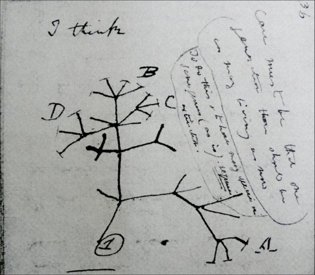
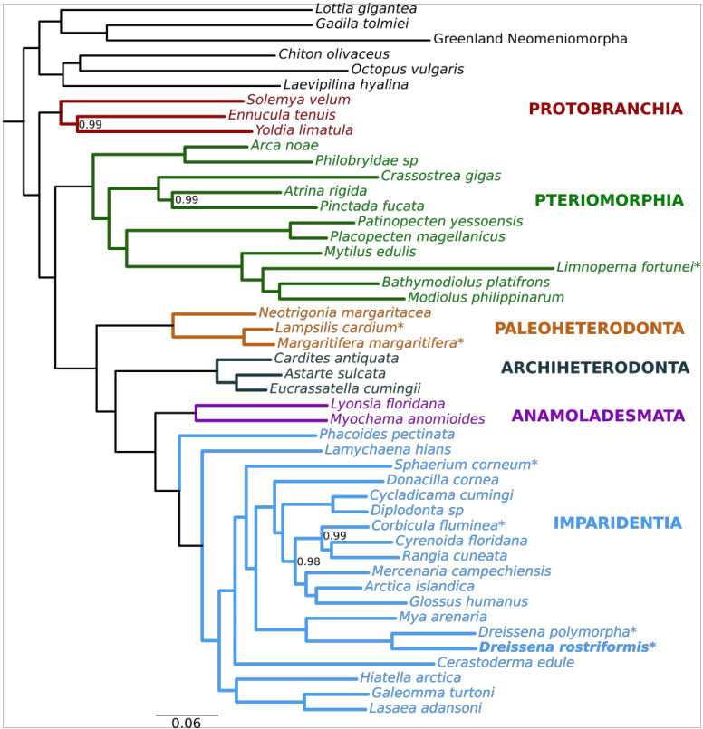
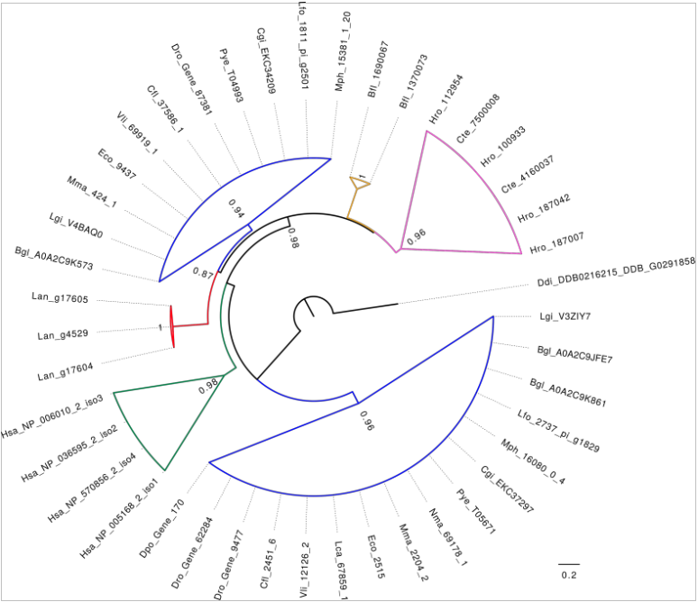
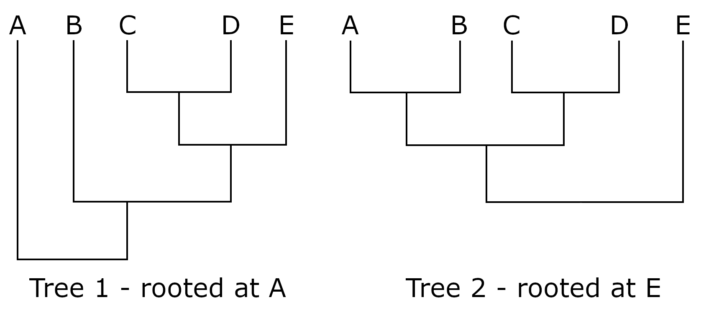

# Phylogenetics I

Phylogenetics is the study of the relatedness of genes and species. The first branched phylogenetic tree was created by Darwin as a rough sketch in a notebook in 1837 which has since become known as the "I think" sketch.



Beside this he scribbled:

>Case must be that one generation should have as many living as now.
>To do this & to have many species in same genus (as is) requires extinction.
>Thus between A and B immense gap of relation.
>C and B the finest gradation, B and D rather greater distinction.
>Thus genera would be formed. — bearing relation to ancient types with several extinct forms.

This was the first articulation of the idea of `descent with modification` which underpins our understanding of evolution by natural selection to this day. What the figure and the caption illustrate is the idea that all species alive today share common ancestors and that over the immense time since the divergence of all extant species, an incalculable number of other species which *fill the gaps* between modern species have gone extinct. This process of extinction of less well suited organisms and the survival of more well suited ones is the engine that drives the evolutionary process. This was a revolutionary insight by Darwin is made even more remarkable by the fact that he had no idea about genetics or the process by which novel character emergence could come to pass.

While early trees were based entirely on phenotypic character trait analysis, today we also have the option of building relationship trees based on genetic traits ie. genetic sequences. When we do this for whole genomes to ascertain the relatedness of species, this is called `phylogenomics`.



But when we do this for single genes/proteins, this is called `phylogenetics`, although you do see people using this term for the study of species too.



Today we are going to build phylogenetic trees of our gene family of interest, based on the multiple sequence alignment we created in the previous tutorial. As with all things bioinformatics, there is more than one way to skin a cat. In the phylogenetics lectures you learnt about multiple methods to infer relatedness between aligned sequences including Neighbour Joining (NJ), Maximum Likelihood (ML), Bayesian Inference etc. Today we'll try to build two trees, one using a simple NJ algorithm and another using a more sophisticated ML algorthim to compare their performance in terms of accuracy and computational demand.

>Phylogenetic trees represent the evolutionary relationships among sequences. Closely related sequences are grouped together, and branch lengths indicate the amount of evolutionary change or genetic distance between them.

This means that to go from a multiple sequence alignment to a phylogenetic tree, we first need a way to compute the *pairwise* distances between each sequence in our alignment. There are many ways to create a distance matrix, and we will try a few, but the simplest one is to simply calculate a p-value describing the number of differences at each position in an alignment between two sequences. We will try this out in the following neighbour joining tree example.

## Neighbour Joining tree

Neighbour joining builds a tree that iteratively joins pairs of taxa that minimise the total branch length of the tree. To do this, NJ algorithms take in a distance matrix which contains pairwise evolutionary distances between taxa, calculated from a multiple sequence alignment. Let's have a go at creating one so we can see what this means along the way.

In RStudio, set your working directory to your `phylogenetic_project` directory, create a new folder inside called something like `trees` and then inside this, create `NJ`.

```R

setwd("~/working-directory/phylogenetic_project")

dir.create("trees/NJ", recursive = TRUE)

```

Now we are going to load all the appropriate libraries including the `phangorn` package for tree construction and we'll also load our MSA.

```R

library(phangorn)
library(Biostrings)

# Load the alignment file
alignment <- readAAStringSet("msa/msa_muscle_aligned_sequences.fa")

# Convert Convert to phangorn format
phyDat_alignment <- as.phyDat(alignment, type = "AA")

```

We are now at the point where we need to take our MSA and use this to calculate a distance matrix. We are going to use the dist.hamming() function from the `phangorn` package that calculates the number of differing positions in a pairwise alignment divided by the total number of positions - essentially a p-value.

```R

# Create a p-value based distance matrix
dm <- dist.hamming(phyDat_alignment)

# To inspect dm, convert to a matrix
dm_matrix <- as.matrix(dm)

```

Now we can build and inspect our first tree.

```R

# Build an NJ tree from our distance matrix
nj_tree <- NJ(dm)

# Visualise this initial tree
plot(nj_tree, main = "Neighbor-Joining Tree", 
     cex = 0.7, label.offset = 0.01, direction = "rightwards")
add.scale.bar(x = 0, y = 0.5, cex = 0.7, lwd = 2)

```

Even better than this, we can use `ggtree` rather than base R to plot our tree. That way we can save it as an object rather than re-plotting it every time we want to look at it.

```R
library(ggtree)
library(ggplot2)
library(ape)

p <- ggtree(nj_tree) +
    geom_tiplab(size = 3) +
    geom_treescale(x = 0, y = -1, width = 0.1, linesize = 2) +  # Scale bar
    hexpand(.4) +  # Adds extra space for labels
    ggtitle("Neighbor-Joining Tree")

p

# Save the plot as a png
ggsave("trees/NJ/nj_tree.png", plot = p, width = 12, height = 8, dpi = 300)

```

This creates an `unrooted` tree which you will be able to see in your RStudio Plot pane. Have a look at the tree you've created to see if it makes evolutionary sense ie. do related sequences share a common ancestor? Next up, we'll root the tree by defining an outgroup which we spoke about in our previous tutorial. Remember that rooting a tree uses prior knowledge of your sequences to declare which is most divergent, prior to plotting. Rooting at different nodes preserves topology but changes the interpretation of evolutionary relationships.



```R

# Root the tree on your outgroup sequence
outgroup <- "Cin_Pax6_NP_001027641.1 homeobox transcription factor Pax6 [Ciona intestinalis]"
nj_tree_outgroup <- root(nj_tree, outgroup = outgroup, resolve.root = TRUE)

# Plot your rooted tree
p_rooted <- ggtree(nj_tree_outgroup) +
            geom_tiplab(size = 3) +
            geom_treescale(x = 0, y = -1, width = 0.1, linesize = 2) +
            hexpand(.4) +
            ggtitle("Neighbor-Joining Tree (outgroup rooted)")
  
p_rooted

ggsave("trees/NJ/nj_tree_rooted.png", plot = p_rooted, width = 12, height = 8, dpi = 300)

```

We can also calculate the confidence level of each node in the tree by `bootstrapping` it. Bootstrapping is a statistical resampling method used to estimate the reliability of a result by repeatedly sampling from your original data with replacement. In this case, *replacement* means to randomly sample columns from your MSA, rather than using the original sequence order to see if these purturbations influence the final topology of the tree. The theory is that if your tree is **robust**, this process of resampling with replacement should produce a tree with the same topology more often than not. Topology referes to how each sample relates to one another. Here's an example:

Original aligment of 8 amino acid sequeces
```text

Position:          1  2  3  4  5  6  7  8
Sequence A:        M  K  R  D  L  M  R  E
Sequence B:        M  K  H  D  V  M  R  Q
Sequence C:        L  S  R  D  L  I  G  E
Sequence D:        L  S  H  N  V  I  G  Q

```

This creates a tree with the topology:

```text

Original tree topology: ((A,B),(C,D))

```
Now we do bootstrap replicate 1:
Randomly selected positions: 1, 1, 3, 5, 2, 7, 8, 4

```text

Position:          1  1  3  5  2  7  8  4
Sequence A:        M  M  R  L  K  R  E  D
Sequence B:        M  M  H  V  K  R  Q  D
Sequence C:        L  L  R  L  S  G  E  D
Sequence D:        L  L  H  V  S  G  Q  N

```

Now we recalculate topology:

```text

Bootstrap tree 1: ((A,B),(C,D)) ✓ Same topology

```

Now we do bootstrap replicate 2:

Randomly selected positions: 2, 4, 4, 6, 8, 3, 1, 1

```text

Position:          2  4  4  6  8  3  1  1
Sequence A:        K  D  D  M  E  R  M  M
Sequence B:        K  D  D  M  Q  H  M  M
Sequence C:        S  D  D  I  E  R  L  L
Sequence D:        S  N  N  I  Q  H  L  L

```

Calculate topology:

```text

>Bootstrap tree 2: (A,(B,(C,D))) ✗ Different topology!

```

After doing this 100 or 10000 times, we see how many trees we build from these resampled MSAs have the same or different topology.

```text

Clade (A,B):    appeared in 85 trees → Bootstrap support = 85%
Clade (C,D):    appeared in 92 trees → Bootstrap support = 92%
Clade ((A,B),(C,D)): appeared in 78 trees → Bootstrap support = 78%

```

And now we can add these bootstrap values to our original tree:

```text

                         78
            ┌────────────┴────────────┐
            │                         │
         85 │                      92 │
    ┌───────┴───────┐        ┌────────┴────────┐
    │               │        │                 │
Sequence A       Sequence B   Sequence C     Sequence D

```

Let's do this for our tree.

```R

# Convert phyDat to AAbin format
alignment_AAbin <- as.AAbin(phyDat_alignment)

# Bootstrap using manual resampling
set.seed(123)  # For reproducibility
boot_trees <- list()

# Run bootstrapping with 1000 replicates
for(i in 1:1000) {

  # Create a vector of random column numbers
  boot_indices <- sample(ncol(alignment_AAbin), replace = TRUE)
  
  # Use those column numbers to create new modified alignment
  boot_alignment <- alignment_AAbin[, boot_indices]
  
  # Convert from AAbin format to phyDat (phangorn) format
  boot_phyDat <- as.phyDat(boot_alignment)
  
  # Calculate distance matrix of evolutionary distances between every pair of sequences
  boot_dm <- dist.hamming(boot_phyDat)
  
  # Build tree
  boot_tree <- NJ(boot_dm)
  
  # Root with the same outgroup
  boot_tree <- root(boot_tree, outgroup = outgroup, resolve.root = TRUE)
  boot_trees[[i]] <- boot_tree
  
  # Monitor progress and report every time ten new bootstraps have been completed
  if(i %% 10 == 0) cat(i, " ")
}
cat("Done!\n")

# Calculate bootstrap support for all nodes
nj_bs <- prop.clades(nj_tree_outgroup, boot_trees)
nj_bs_percent <- round(nj_bs / length(boot_trees) * 100, 0)

# Plot NJ tree with bootstrap values
# Add bootstrap values to tree
nj_tree_outgroup$node.label <- nj_bs_percent

# Plot using the label aesthetic
p_bootstrapped <- ggtree(nj_tree_outgroup) +
    geom_tiplab(size = 3, offset = 0.01) +
    geom_nodelab(aes(label = label),      # Now it uses tree$node.label
                 size = 2.5,
                 hjust = -0.2,
                 vjust = 0.5) +
    geom_treescale(x = 0, y = -0.5, 
                   width = 0.1, 
                   linesize = 2,
                   fontsize = 3) +
    hexpand(.4) +
    ggtitle("NJ Tree with Bootstrap Support (outgroup rooted)")

```

### Neighbour Joining tree with Maximum Likelihood calculated distance matrix

This is all good and well, but we can do better than just using a p-value to calculate distances. While the p-distance is just the proportion of mismatched sites, we can use more sophisticated models to correct for multiple substitutions at the same site, unequal base frequencies, transition/transversion biases amongst other parameters. Prior to building our tree above, we created a distance matrix using `dist.hamming()`. Another option is to use `dist.ml()` which applies a *maximum likelihood* approach. This method asks: `Given a certain evolutionary distance, what's the probability of observing the differences we see in the sequences?` 

The reason that the answer to that question is not 100% is because not all substitutions are equally probable given an amount of evolutionary time. As we saw in our BLAST lecture and tutorial, the probability of one amino acid being substituted for another amino acid with similar chemical properties is is more likely than it being substituted for an amino acid with different chemical properties. These probabilities were described by the substitution matrix that we chose, the most common of which is `BLOSUM62`. 

Like the BLAST algorithm, phylogenetic analysis can take advantage of sophisticated substitution matrices to more accurately model evolutionary change between two sequences. When we run `dist.ml()`, at every position in the pairwise alignment, it calculates the probability that we see the two amino acids observed given an evolutionary distance of `d`, the units of which are `expected subsitutions per site`. It then sums up the log of these likelihood values for each position to calculate a `log likelihood` value for the whole pairwise alignment. The algorithm then recalculates this value multiple times using a range of vaulues of `d` so that in the end it can determine the value of `d` at which the log likelihood is maximised. It are these `maximum likelihood distance values (d)` that are used to populate the distance matrix.

Here's a visual representation:

```text

# Alignment
Position:    1  2  3  4  5
Sequence A:  M  K  R  D  L
Sequence B:  M  K  H  D  V
             ✓  ✓  ✗  ✓  ✗

# Key equations
P(i→j | distance d) = probability that amino acid i changes to j 
                      over evolutionary distance d

P(i=i | distance d) = probability amino acid i stays unchanged
                      over evolutionary distance d
                      
# Calculate likelihood for distance d = 0.1 (0.1 changes per site)
Position 1: M → M (no change)
P(M stays M | d=0.1) = 0.95  (high - short time, unlikely to change)

Position 2: K → K (no change)
P(K stays K | d=0.1) = 0.94

Position 3: R → H (changed)
P(R→H | d=0.1) = 0.008  (low - not much time for change)

Position 4: D → D (no change)
P(D stays D | d=0.1) = 0.95

Position 5: L → V (changed)
P(L→V | d=0.1) = 0.012  (low - similar amino acids but still unlikely in short time)

Total likelihood = 0.95 × 0.94 × 0.008 × 0.95 × 0.012 = 0.0000081
Log-likelihood = ln(0.0000081) = −9.42

# Calculate likelihood for distance d = 0.5
Position 1: M → M (no change)
P(M stays M | d=0.5) = 0.65  (still likely to stay same)

Position 2: K → K (no change)
P(K stays K | d=0.5) = 0.63

Position 3: R → H (changed)
P(R→H | d=0.5) = 0.042  (more reasonable - had time to change)

Position 4: D → D (no change)
P(D stays D | d=0.5) = 0.64

Position 5: L → V (changed)
P(L→V | d=0.5) = 0.055  (reasonable for similar amino acids)

Total likelihood = 0.65 × 0.63 × 0.042 × 0.64 × 0.055 = 0.000061
Log-likelihood = ln(0.000061) = -7.41

# Calculate likelihood for distance d = 1.0
Position 1: M → M (no change)
P(M stays M | d=1.0) = 0.35  (lower - had lots of time to change)

Position 2: K → K (no change)
P(K stays K | d=1.0) = 0.33

Position 3: R → H (changed)
P(R→H | d=1.0) = 0.068  (high - had time)

Position 4: D → D (no change)
P(D stays D | d=1.0) = 0.34

Position 5: L → V (changed)
P(L→V | d=1.0) = 0.082  (high - had time)

Total likelihood = 0.35 × 0.33 × 0.068 × 0.34 × 0.082 = 0.000022
Log-likelihood = ln(0.000022) = -8.42

# Plot the log-likelihood distance
Log-likelihood

     |
-7.5 |            ★ (maximum at d ≈ 0.5)
     |         /     \
-8.0 |        /       \
     |      /           \
-8.5 |     /             \
     |    /               \
-9.0 |   /                  \
     |  ●                    ●
-9.5 |/________________________\_
     0   0.2  0.4  0.6  0.8  1.0    d (substitutions/site)

     d=0.1        d=0.5        d=1.0
     ln(L)=-9.42  ln(L)=-7.41  ln(L)=-8.42
     
```

Ok, let's try create a maximum likelihood distance matrix and then use this to recreate our NJ tree. In this example, as we are using the [JTT](https://academic.oup.com/bioinformatics/article/8/3/275/193076?login=true) model which is an empirically derived model based on observed substitution rates.

```R

# Create a maximum likelihood distance matrix
dm_ml <- dist.ml(phyDat_alignment, model = "JTT")

```

You can now go back to the `NJ(dm)` step above to use this new distance matrix to compare it to the old p-distance matrix we created first. Remember when calculating bootstrap values to use `boot_dm <- dist.ml(boot_phyDat, model = "JTT")` rather than `boot_dm <- dist.hamming(boot_phyDat)`.

## For next week

Today we produced two trees - a neighbour joining tree using a p-value distance matrix, and a second neighbour joining tree using a maximum likelihood distance matrix. Next week we will move on from NJ trees and produce a Maximum Likelihood tree directly. To do this, we are required to provide an initial tree over which the ML algorithm will iterate to produce a new, hopefully more reliable tree. 

Several options exist for which tree we should begin with including a random tree with a topology not based on anything biological at all, a tree with a single node from which all branches radiate (basically a huge polytomy that resembles a star), or we could provide it a guide tree calculated using some other algorithm that has some sort of grounding in biological truth. How convenient then that that's exactly what we produced today!

As such, you should save an NJ tree as an RData object so that we can reuse it next week. While it's not super important that this be the best tree you created today (ie. the NJ tree from your ML distance matrix), choosing the best tree will reduce compute time and can improve the final result. Assuming you followed the instructions above, your options for which tree to save will either be:

>nj_tree # The initial tree you produced  
>nj_tree_outgroup # The rooted, bootstrapped version of the NJ p-value tree  
>nj_ml_tree # The tree produced using the ML distance matrix  
>nj_ml_tree_outgroup # The rooted, bootstrapped version of the NJ ML tree  

As my best tree was the NJ ML tree, I'll go with that one.

```R

save(nj_ml_tree_outgroup, file = "trees/NJ/nj_ml_tree_outgroup.RData")

```

If you've lost the tree and need to regenerate it, here's another option for you.

```R

dm_ml <- dist.ml(phyDat_alignment, model = "JTT")
nj_ml_tree <- NJ(dm_ml)
save(nj_ml_tree, file = "trees/NJ/nj_ml_tree.RData")

```