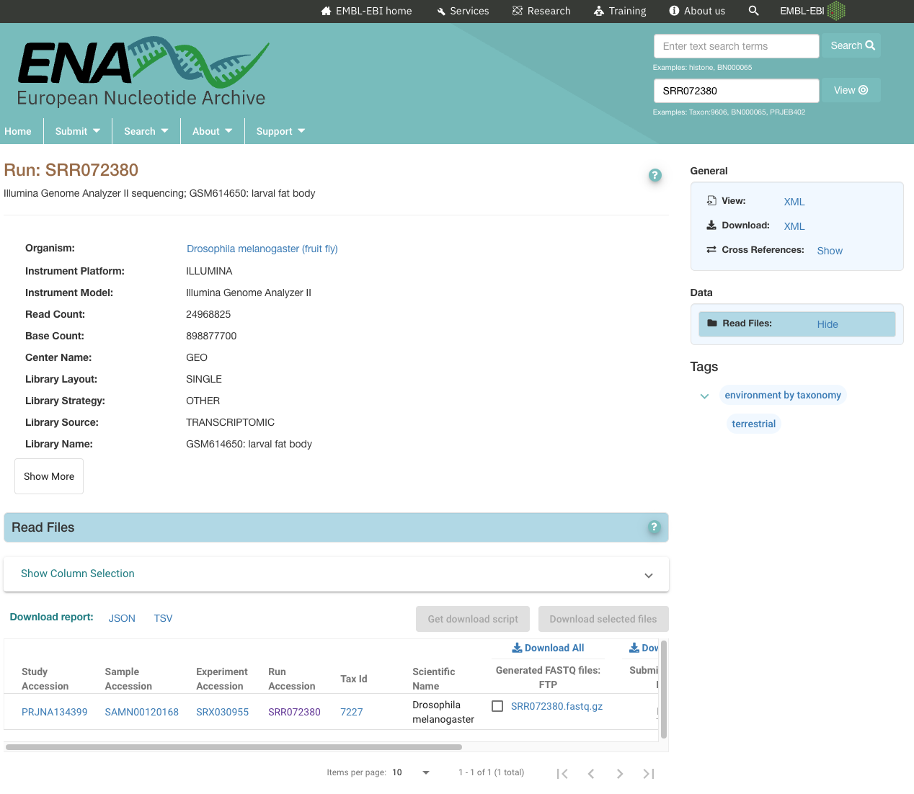
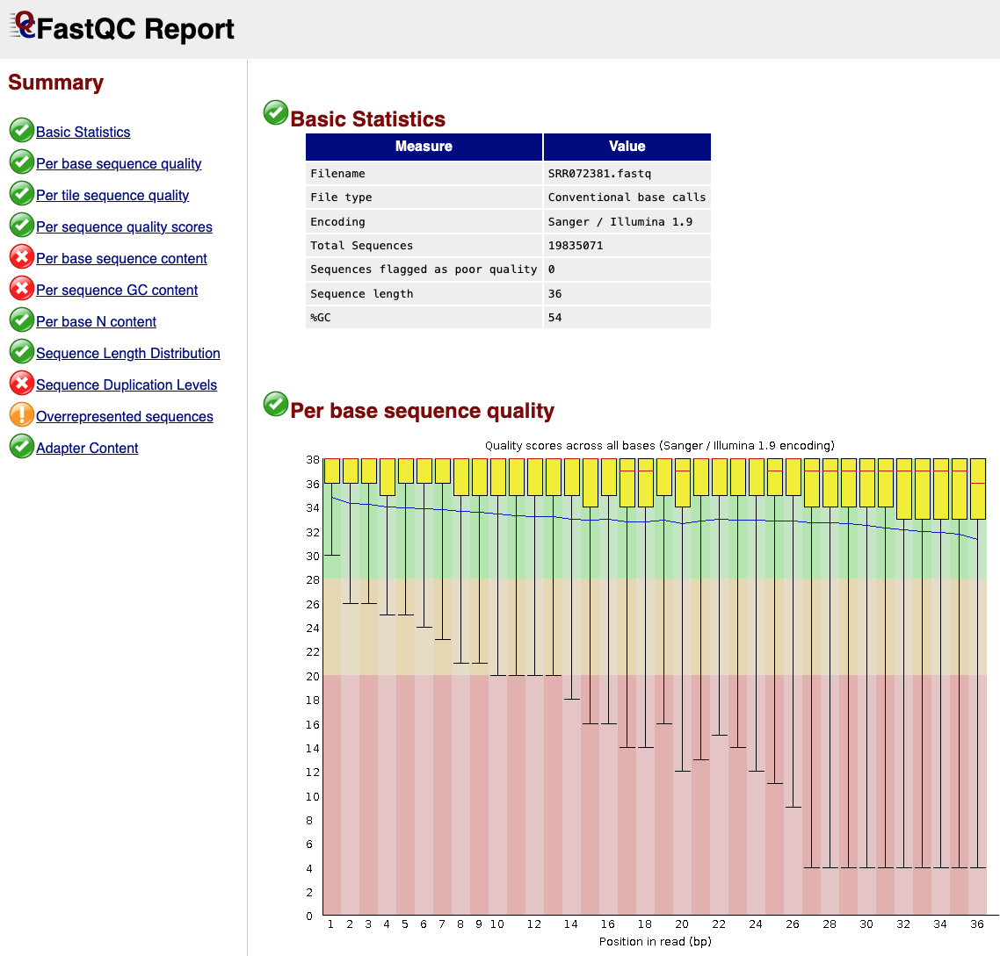

# Read Mapping

Today we are going to head straight to the command line. Instead of R, we'll be using the bash shell to learn about some of the basic steps involved in mapping high-throughput second generation sequencing datasets to a genome. For this purpose, we have available to us a couple of *Drosophila melanogaster* datasets sequenced on an Illumina GAIIx. In the next gen sequencing world, these datasets would be considered historical relics worthy of presentation in a museum, but they have been selected for you today becuase they are small (only a few hundred Mb each) and so easy to manipulate on a moderately sized machine in a reasonable amount of time.

These datasets can be found in `~/shared-data/fastqs` and were obtained from the European Nucleotide Archive (ENA).



Incidentally, I tried for a long time to get these same datasets from NCBI but it seems that they've deleted the quality scores from these old fastqs to save space on their servers but this means that they are pretty much useless now.

Just as a reminder, these huge fastq files are the result of a sequencing run on and Illumina machine which produces a very large number of reads of a defined length using their `sequencing by synthesis` method. The following image should be a reminder of the basic idea of how a library looks right when its loaded onto a sequencer.


This is what it would look like if we were sequencing a paired end library where we have a sequencing primer at each end of an insert. In this case, the insert is usually a bit larger than the sum of the two sequencing reads so that for every insert, we sequence a bit at the beginning and a bit at the end with a bit in the middle remaining unsequenced. As library fragmentation is not a perfect science, we usually have some fragments short enough that the two reads overlap and in some cases, reads that pass through the insert and into the opposite adapter.

Another issue is that due to issues with the resolution of the growing spots on an Illumina sequencing chip, you often see a degradation in read quality towards the 3' end of each read. The libraries we are looking at today are so old that they pre-date paired-end sequencing and so instead of have matched reads from each end of an insert, we just have a single one. Let's see if we can identify any low quality or adapter sequence in our libraries using a program called `fastqc`.

```bash

cd ~/working-directory

# Create a new folder for today's project

mkdir mapping_project
cd mapping_project

# Run fastqc
fastqc -o ./ ~/shared-data/fastqs/

```

Once this is complete, go to your own machine and scp the resulting html file to your own computer.


```bash

scp andrewc@bioinformatics.nec-mf-proj01.cloud.edu.au:~/working-directory/mapping_project/SRR072381_fastqc.html ./

```



One thing should be pretty clear - we need to trim low quality sequences. To do this, there are a stack of programs that have been written to trim reads based on quality scores and also for trimming out an adapter sequence that may have crept into the 3' end of some of the reads. Today we are going to try a program called `bbduk` which is part of the `BBTools` suite.

```bash

# Run bbduk on your fastq file making sure to tell it where to find the adapters fasta

bbduk.sh in=~/shared-data/fastqs/SRR072380.fastq out=SRR072380_trimmed.fastq t=8 ref=~/shared-data/adapters/adapters.fa ktrim=r k=31 mink=31 hdist=1 qtrim=r trimq=30

```

Once this is done, run fastqc on the newly trimmed fastq and compare it to the previous fastqc result.

```bash

fastqc SRR072380_trimmed.fastq

```

Notice any changes?

Next up, we are going to map these reads to the fruit fly genome to see where they were all expressed from. To do this we are going to use `STAR` aligner

```bash
# STAR with parameters optimized for 36bp
STAR --genomeDir /home/andrewc/shared-data/genomes/star_index_36bp \
  --readFilesIn /home/andrewc/working-directory/mapping_project/SRR072380_trimmed.fastq \
  --runThreadN 12 \
  --outFileNamePrefix midgut_ \
  --outSAMtype BAM SortedByCoordinate \
  --quantMode GeneCounts \
  --outFilterMismatchNmax 2 \
  --outFilterMultimapNmax 10 \
  --alignSJoverhangMin 6 \
  --alignSJDBoverhangMin 1 \
  --seedSearchStartLmax 20

```

Awesome, you've just mapped your first high-throughput sequencing dataset to a genome. The next thing we'll try and do is visualise this but to do so, we first need to take our mapped BAM file and convert it to a format that is plays nicely with a genome browser. We'll go with a format called `BedGraph` and we'll also normalise our read counts so that we can make more accurate comparisons between the two samples.

``` bash

# Index your BAM files if not done
samtools index midgut_Aligned.sortedByCoord.out.bam

# Get total mapped read counts for normalization
# -F 260 excludes unmapped and secondarily aligned reads
READS=$(samtools view -c -F 260 midgut_Aligned.sortedByCoord.out.bam)

echo $READS

# Calculate CPM scaling factors
# bc is a calculator, scale=10 tells it to go to 10 digits
SCALE=$(echo "scale=10; 1000000/$READS" | bc)

# Generate bedGraph
genomeCoverageBed -ibam midgut_Aligned.sortedByCoord.out.bam -bg -scale $SCALE >midgut_CPM.bedGraph

# Finally, sort the bedGraph file
sort -k1,1 -k2,2n midgut_CPM.bedGraph >midgut_CPM_sorted.bedGraph

```

Once this is done, scp it to your own computer.

```bash

scp andrewc@bioinformatics.nec-mf-proj01.cloud.edu.au:/home/andrewc/working-directory/mapping_project/midgut_CPM_sorted.bedGraph ./

```

Now you're ready to have a look at your work. Navigate to [IGV](https://igv.org/app/) to see the IGV genome browser. Here you can select from a bunch of defferent genomes but today we want to use *Drosophila melanogaster* dm6. You can upload your track by clicking on `Tracks`, `Local File`. Try uploading both bedGraph files to and navigate around to compare expression levels of particular genes.